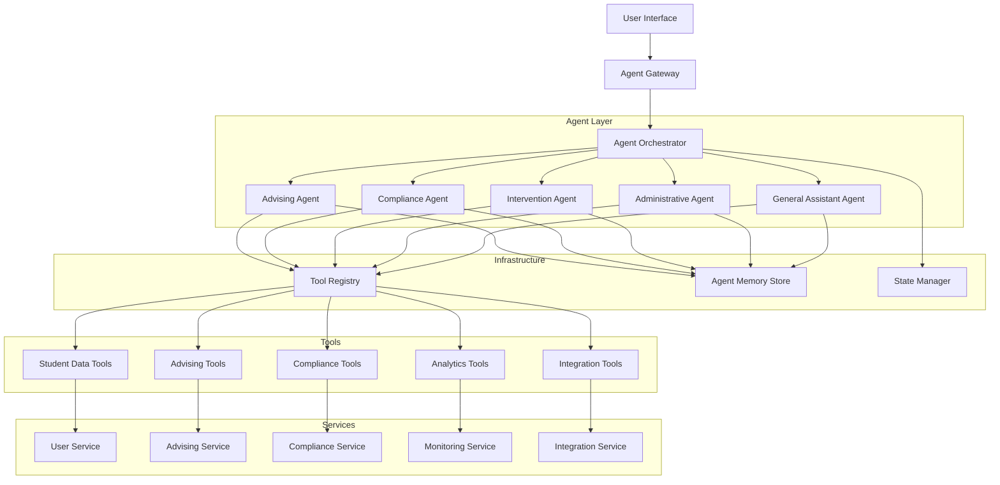
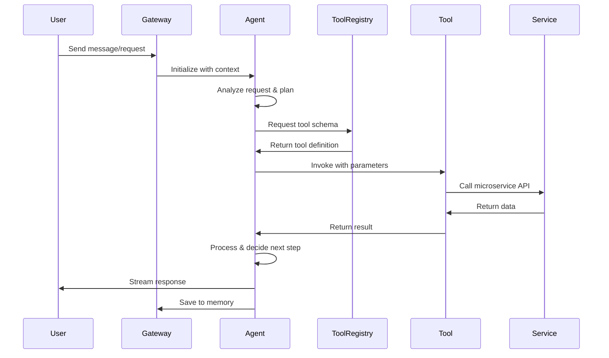

# Design Document

## Overview

This design document outlines the architecture for implementing AI agents in the Athletic Academics Hub (AAH) platform using the Vercel AI SDK. The implementation follows modern agentic AI patterns where autonomous agents can perceive context, make decisions, use tools, and execute multi-step workflows to achieve goals.

The agent system is built on three core principles:
- **Tool-Augmented Intelligence**: Agents use tools to interact with microservices, databases, and external APIs
- **Autonomous Decision-Making**: Agents plan and execute multi-step workflows with minimal human intervention
- **Collaborative Intelligence**: Multiple specialized agents work together on complex tasks

Key technologies:
- **Vercel AI SDK**: Core framework for streaming, tool calling, and agent orchestration
- **Zod**: Schema validation for type-safe tool definitions
- **LangChain**: Advanced agent patterns and memory management
- **Langfuse**: Observability and tracing for agent operations

## Architecture

### High-Level Agent Architecture



### Agent Execution Flow



## Components and Interfaces

### 1. Agent Gateway

**Responsibility**: Entry point for all agent interactions, handles routing, authentication, and streaming

**Technology Stack**:
- Framework: Hono with streaming support
- Deployment: Vercel Edge Functions for low latency
- Streaming: Server-Sent Events (SSE) for real-time updates

**API Endpoints**:
```typescript
POST   /api/agent/chat              // General conversational agent
POST   /api/agent/advising          // Specialized advising agent
POST   /api/agent/compliance        // Compliance analysis agent
POST   /api/agent/intervention      // Intervention planning agent
POST   /api/agent/admin             // Administrative automation agent
GET    /api/agent/status/:taskId    // Check agent task status
POST   /api/agent/cancel/:taskId    // Cancel running agent task
GET    /api/agent/history/:userId   // Get agent interaction history
```

**Key Components**:
- **RequestRouter**: Routes requests to appropriate specialized agents
- **StreamManager**: Manages SSE connections for real-time updates
- **AuthMiddleware**: Validates user permissions for agent access
- **RateLimiter**: Enforces token budgets and request throttling

### 2. Agent Orchestrator

**Responsibility**: Coordinates multiple agents, manages workflows, handles agent collaboration

**Core Implementation**:
```typescript
import { streamText, tool } from 'ai'
import { openai } from '@ai-sdk/openai'
import { z } from 'zod'

class AgentOrchestrator {
  private agents: Map<string, Agent>
  private toolRegistry: ToolRegistry
  private stateManager: StateManager
  
  async executeWorkflow(request: AgentRequest): Promise<AgentResponse> {
    // 1. Analyze request and select agent(s)
    const agents = await this.selectAgents(request)
    
    // 2. Initialize agent state
    const state = await this.stateManager.initialize(request)
    
    // 3. Execute agent workflow
    if (agents.length === 1) {
      return await this.executeSingleAgent(agents[0], state)
    } else {
      return await this.executeMultiAgent(agents, state)
    }
  }
  
  private async executeSingleAgent(agent: Agent, state: AgentState) {
    const tools = await this.toolRegistry.getToolsForAgent(agent.id)
    
    const result = await streamText({
      model: openai('gpt-4'),
      messages: state.messages,
      tools: tools,
      maxSteps: 10,
      onStepFinish: async (step) => {
        await this.stateManager.saveStep(state.id, step)
      }
    })
    
    return result
  }
}
```

**Agent Selection Logic**:
- Intent classification using embeddings similarity
- Rule-based routing for explicit agent requests
- Multi-agent coordination for complex tasks

### 3. Tool Registry

**Responsibility**: Centralized repository of tools with schemas, permissions, and implementations

**Tool Definition Pattern**:
```typescript
import { tool } from 'ai'
import { z } from 'zod'

export const getStudentProfile = tool({
  description: 'Retrieve student profile including academic records and athletic information',
  parameters: z.object({
    studentId: z.string().describe('The unique student identifier'),
    includeHistory: z.boolean().optional().describe('Include historical academic records')
  }),
  execute: async ({ studentId, includeHistory }) => {
    // Call User Service API
    const response = await fetch(`/api/user/profile/${studentId}`)
    const profile = await response.json()
    
    if (includeHistory) {
      const history = await fetch(`/api/monitoring/performance/${studentId}`)
      profile.history = await history.json()
    }
    
    return profile
  }
})
```

**Tool Categories**:
- **Student Data Tools**: Profile, academic records, athletic schedules
- **Compliance Tools**: Eligibility checks, rule lookups, violation analysis
- **Advising Tools**: Course search, conflict detection, degree audit
- **Integration Tools**: Email sending, calendar management, document generation
- **Analytics Tools**: Performance metrics, risk assessment, reporting

**Tool Registry Implementation**:
```typescript
class ToolRegistry {
  private tools: Map<string, ToolDefinition>
  private permissions: Map<string, string[]> // toolId -> allowed roles
  
  registerTool(tool: ToolDefinition, allowedRoles: string[]) {
    this.tools.set(tool.id, tool)
    this.permissions.set(tool.id, allowedRoles)
  }
  
  async getToolsForAgent(agentId: string, userRole: string): Promise<Tool[]> {
    const agentTools = this.getAgentToolMapping(agentId)
    return agentTools.filter(tool => 
      this.permissions.get(tool.id)?.includes(userRole)
    )
  }
}
```

### 4. Specialized Agents

#### Advising Agent

**Purpose**: Autonomous course recommendations, scheduling, and degree planning

**Tools Available**:
- `searchCourses`: Search course catalog with filters
- `checkConflicts`: Detect scheduling conflicts with athletics
- `getDegreeRequirements`: Retrieve degree requirements
- `calculateProgress`: Calculate degree completion progress
- `getPrerequisites`: Get prerequisite chains for courses
- `recommendCourses`: Get AI-powered course recommendations

**Agent Prompt Template**:
```typescript
const advisingAgentPrompt = `You are an expert academic advisor for student-athletes.
Your role is to help students select courses that:
1. Meet degree requirements
2. Avoid conflicts with athletic commitments
3. Maintain NCAA eligibility
4. Align with student interests and career goals

When making recommendations:
- Always check for scheduling conflicts
- Verify prerequisites are met
- Consider course difficulty and workload
- Explain your reasoning clearly
- Provide alternative options when conflicts exist

Use the available tools to gather information and validate recommendations.`
```

**Workflow Example**:
```typescript
async function advisingWorkflow(studentId: string, query: string) {
  const result = await streamText({
    model: openai('gpt-4'),
    system: advisingAgentPrompt,
    messages: [{ role: 'user', content: query }],
    tools: {
      getStudentProfile,
      searchCourses,
      checkConflicts,
      getDegreeRequirements,
      recommendCourses
    },
    maxSteps: 10
  })
  
  return result
}
```

#### Compliance Agent

**Purpose**: NCAA rule interpretation, eligibility analysis, scenario simulation

**Tools Available**:
- `searchNCAARules`: Semantic search of NCAA bylaws
- `checkEligibility`: Validate current eligibility status
- `simulateScenario`: Simulate hypothetical eligibility scenarios
- `getViolations`: Retrieve eligibility violations
- `calculateGPA`: Calculate term and cumulative GPA
- `checkProgressTowardDegree`: Validate progress-toward-degree requirements

**Agentic RAG Implementation**:
```typescript
const complianceRAGTool = tool({
  description: 'Search NCAA Division I bylaws and compliance rules',
  parameters: z.object({
    query: z.string().describe('The compliance question or rule to search for'),
    topK: z.number().optional().describe('Number of results to return')
  }),
  execute: async ({ query, topK = 5 }) => {
    // Generate embedding for query
    const embedding = await generateEmbedding(query)
    
    // Vector search in pgvector
    const results = await prisma.$queryRaw`
      SELECT content, metadata, 
             1 - (embedding <=> ${embedding}::vector) as similarity
      FROM vector_embeddings
      WHERE content_type = 'ncaa_rule'
      ORDER BY embedding <=> ${embedding}::vector
      LIMIT ${topK}
    `
    
    return results
  }
})
```

#### Intervention Agent

**Purpose**: Identify at-risk students, analyze root causes, generate intervention plans

**Tools Available**:
- `getPerformanceMetrics`: Retrieve academic performance data
- `assessRisk`: Run predictive risk models
- `analyzeRootCauses`: Identify factors contributing to poor performance
- `generateInterventionPlan`: Create personalized intervention strategies
- `scheduleFollowUp`: Automatically schedule follow-up tasks
- `notifyStaff`: Send notifications to support staff

**Multi-Step Workflow**:
```typescript
async function interventionWorkflow(studentId: string) {
  const agent = await streamText({
    model: openai('gpt-4'),
    system: `You are an intervention specialist. Analyze student performance,
             identify risk factors, and create actionable intervention plans.`,
    messages: [
      { role: 'user', content: `Analyze student ${studentId} and create intervention plan` }
    ],
    tools: {
      getPerformanceMetrics,
      assessRisk,
      analyzeRootCauses,
      generateInterventionPlan,
      scheduleFollowUp,
      notifyStaff
    },
    maxSteps: 15,
    onStepFinish: async (step) => {
      // Log each step for observability
      console.log(`Step ${step.stepNumber}: ${step.toolCalls?.map(t => t.toolName).join(', ')}`)
    }
  })
  
  return agent
}
```

#### Administrative Agent

**Purpose**: Automate administrative tasks like travel letters, notifications, scheduling

**Tools Available**:
- `generateTravelLetter`: Create personalized travel letters
- `sendEmail`: Send emails via Integration Service
- `scheduleEvent`: Create calendar events
- `generateReport`: Create automated reports
- `updateRecords`: Update student records
- `notifyFaculty`: Send faculty notifications

**Confirmation Pattern**:
```typescript
const updateRecordsTool = tool({
  description: 'Update student records (requires user confirmation)',
  parameters: z.object({
    studentId: z.string(),
    updates: z.record(z.any())
  }),
  execute: async ({ studentId, updates }, { confirmationRequired }) => {
    // Request user confirmation for state-changing operations
    if (confirmationRequired) {
      return {
        requiresConfirmation: true,
        message: `Confirm updating records for student ${studentId}`,
        updates: updates
      }
    }
    
    // Execute after confirmation
    const result = await updateStudentRecords(studentId, updates)
    return result
  }
})
```

#### General Assistant Agent

**Purpose**: Handle general queries, route to specialized agents, provide information

**Tools Available**:
- All read-only tools from other agents
- `routeToSpecialist`: Escalate to specialized agent
- `searchKnowledgeBase`: General knowledge base search
- `getFAQ`: Retrieve frequently asked questions

**Intent Classification**:
```typescript
async function classifyIntent(query: string): Promise<AgentType> {
  const embedding = await generateEmbedding(query)
  
  // Compare with intent embeddings
  const intents = [
    { type: 'advising', keywords: ['course', 'schedule', 'degree', 'class'] },
    { type: 'compliance', keywords: ['eligibility', 'NCAA', 'rules', 'violation'] },
    { type: 'intervention', keywords: ['struggling', 'help', 'support', 'risk'] },
    { type: 'admin', keywords: ['travel', 'letter', 'notification', 'report'] }
  ]
  
  // Use semantic similarity + keyword matching
  const scores = await Promise.all(
    intents.map(async intent => ({
      type: intent.type,
      score: await calculateSimilarity(embedding, intent)
    }))
  )
  
  return scores.sort((a, b) => b.score - a.score)[0].type
}
```

### 5. Agent Memory System

**Responsibility**: Maintain conversation context, store learned facts, manage memory lifecycle

**Memory Types**:

1. **Short-Term Memory** (Conversation Context):
```typescript
interface ConversationMemory {
  conversationId: string
  messages: Message[]
  context: Record<string, any>
  createdAt: Date
  expiresAt: Date
}
```

2. **Long-Term Memory** (Learned Facts):
```typescript
interface LongTermMemory {
  userId: string
  factType: string
  content: string
  embedding: number[]
  confidence: number
  createdAt: Date
  expiresAt: Date | null
}
```

3. **Working Memory** (Agent State):
```typescript
interface WorkingMemory {
  agentId: string
  taskId: string
  state: Record<string, any>
  toolResults: ToolResult[]
  stepHistory: Step[]
}
```

**Memory Management**:
```typescript
class AgentMemoryStore {
  async saveConversation(conv: ConversationMemory) {
    await prisma.conversation.create({ data: conv })
  }
  
  async getRelevantMemories(userId: string, query: string, limit: number = 5) {
    const embedding = await generateEmbedding(query)
    
    const memories = await prisma.$queryRaw`
      SELECT content, fact_type, confidence
      FROM long_term_memory
      WHERE user_id = ${userId}
      ORDER BY embedding <=> ${embedding}::vector
      LIMIT ${limit}
    `
    
    return memories
  }
  
  async summarizeConversation(conversationId: string) {
    const messages = await prisma.message.findMany({
      where: { conversationId },
      orderBy: { timestamp: 'asc' }
    })
    
    // Use LLM to summarize
    const summary = await generateText({
      model: openai('gpt-4-mini'),
      prompt: `Summarize this conversation:\n${messages.map(m => `${m.role}: ${m.content}`).join('\n')}`
    })
    
    return summary.text
  }
}
```

### 6. State Manager

**Responsibility**: Manage agent workflow state, handle persistence, support resumption

**State Persistence**:
```typescript
interface AgentState {
  id: string
  userId: string
  agentType: string
  status: 'running' | 'paused' | 'completed' | 'failed'
  currentStep: number
  maxSteps: number
  messages: Message[]
  toolResults: ToolResult[]
  metadata: Record<string, any>
  createdAt: Date
  updatedAt: Date
}

class StateManager {
  async saveState(state: AgentState) {
    await prisma.agentState.upsert({
      where: { id: state.id },
      create: state,
      update: state
    })
  }
  
  async loadState(stateId: string): Promise<AgentState | null> {
    return await prisma.agentState.findUnique({
      where: { id: stateId }
    })
  }
  
  async resumeWorkflow(stateId: string) {
    const state = await this.loadState(stateId)
    if (!state) throw new Error('State not found')
    
    // Resume from last step
    return await this.continueExecution(state)
  }
}
```

## Data Models

### Agent-Specific Entities

**Agent Task**:
```prisma
model AgentTask {
  id          String   @id @default(cuid())
  userId      String
  agentType   String
  status      String   @default("pending")
  priority    Int      @default(0)
  input       Json
  output      Json?
  steps       Json[]
  tokenUsage  Int?
  cost        Float?
  startedAt   DateTime?
  completedAt DateTime?
  createdAt   DateTime @default(now())
}
```

**Tool Invocation Log**:
```prisma
model ToolInvocation {
  id         String   @id @default(cuid())
  taskId     String
  toolName   String
  parameters Json
  result     Json?
  error      String?
  latency    Int
  timestamp  DateTime @default(now())
}
```

**Agent Memory**:
```prisma
model AgentMemory {
  id         String   @id @default(cuid())
  userId     String
  memoryType String   // short_term, long_term, working
  content    String   @db.Text
  embedding  Unsupported("vector(1536)")?
  metadata   Json
  expiresAt  DateTime?
  createdAt  DateTime @default(now())
  
  @@index([userId, memoryType])
}
```

**Agent Feedback**:
```prisma
model AgentFeedback {
  id             String   @id @default(cuid())
  taskId         String
  userId         String
  rating         Int      // 1-5
  feedbackText   String?  @db.Text
  wasHelpful     Boolean
  flaggedIssue   Boolean  @default(false)
  createdAt      DateTime @default(now())
}
```

## Error Handling

### Agent Error Categories

1. **Tool Execution Errors**:
```typescript
class ToolExecutionError extends Error {
  constructor(
    public toolName: string,
    public parameters: any,
    public originalError: Error
  ) {
    super(`Tool ${toolName} failed: ${originalError.message}`)
  }
}
```

2. **Agent Planning Errors**:
```typescript
class AgentPlanningError extends Error {
  constructor(
    public agentType: string,
    public step: number,
    public reason: string
  ) {
    super(`Agent planning failed at step ${step}: ${reason}`)
  }
}
```

3. **Context Window Exceeded**:
```typescript
class ContextWindowError extends Error {
  constructor(
    public tokenCount: number,
    public maxTokens: number
  ) {
    super(`Context window exceeded: ${tokenCount}/${maxTokens} tokens`)
  }
}
```

### Error Recovery Strategies

**Retry with Exponential Backoff**:
```typescript
async function executeWithRetry<T>(
  fn: () => Promise<T>,
  maxRetries: number = 3
): Promise<T> {
  for (let i = 0; i < maxRetries; i++) {
    try {
      return await fn()
    } catch (error) {
      if (i === maxRetries - 1) throw error
      await sleep(Math.pow(2, i) * 1000)
    }
  }
  throw new Error('Max retries exceeded')
}
```

**Fallback to Simpler Model**:
```typescript
async function executeWithFallback(prompt: string, tools: Tool[]) {
  try {
    return await streamText({
      model: openai('gpt-4'),
      prompt,
      tools
    })
  } catch (error) {
    console.warn('GPT-4 failed, falling back to GPT-4-mini')
    return await streamText({
      model: openai('gpt-4-mini'),
      prompt,
      tools
    })
  }
}
```

**Graceful Degradation**:
```typescript
async function executeWithDegradation(agentRequest: AgentRequest) {
  try {
    // Try full agentic workflow
    return await executeAgenticWorkflow(agentRequest)
  } catch (error) {
    console.warn('Agentic workflow failed, falling back to simple RAG')
    return await executeSimpleRAG(agentRequest)
  }
}
```

## Testing Strategy

### Unit Testing Tools

```typescript
import { describe, it, expect, vi } from 'vitest'

describe('getStudentProfile tool', () => {
  it('should retrieve student profile', async () => {
    const mockFetch = vi.fn().mockResolvedValue({
      json: () => Promise.resolve({ id: '123', name: 'John Doe' })
    })
    global.fetch = mockFetch
    
    const result = await getStudentProfile.execute({ studentId: '123' })
    
    expect(result).toEqual({ id: '123', name: 'John Doe' })
    expect(mockFetch).toHaveBeenCalledWith('/api/user/profile/123')
  })
})
```

### Integration Testing Agents

```typescript
describe('Advising Agent', () => {
  it('should recommend courses without conflicts', async () => {
    const mockTools = {
      getStudentProfile: vi.fn().mockResolvedValue({ sport: 'Basketball' }),
      searchCourses: vi.fn().mockResolvedValue([{ id: 'CS101', name: 'Intro to CS' }]),
      checkConflicts: vi.fn().mockResolvedValue({ hasConflicts: false })
    }
    
    const result = await advisingAgent.execute({
      query: 'Recommend CS courses for spring semester',
      tools: mockTools
    })
    
    expect(mockTools.getStudentProfile).toHaveBeenCalled()
    expect(mockTools.searchCourses).toHaveBeenCalled()
    expect(mockTools.checkConflicts).toHaveBeenCalled()
  })
})
```

### End-to-End Testing

```typescript
describe('Agent Workflow E2E', () => {
  it('should complete full advising workflow', async () => {
    const response = await fetch('/api/agent/advising', {
      method: 'POST',
      body: JSON.stringify({
        userId: 'test-user',
        query: 'Help me plan my spring schedule'
      })
    })
    
    const stream = response.body
    const reader = stream.getReader()
    
    let steps = []
    while (true) {
      const { done, value } = await reader.read()
      if (done) break
      steps.push(value)
    }
    
    expect(steps.length).toBeGreaterThan(0)
    expect(steps[steps.length - 1]).toContain('course recommendations')
  })
})
```

## Performance Optimization

### Token Usage Optimization

**Prompt Compression**:
```typescript
function compressPrompt(messages: Message[]): Message[] {
  if (messages.length <= 10) return messages
  
  // Keep first 2 and last 5 messages, summarize middle
  const first = messages.slice(0, 2)
  const last = messages.slice(-5)
  const middle = messages.slice(2, -5)
  
  const summary = summarizeMessages(middle)
  
  return [...first, { role: 'system', content: summary }, ...last]
}
```

**Selective Tool Loading**:
```typescript
function selectRelevantTools(query: string, allTools: Tool[]): Tool[] {
  const queryEmbedding = generateEmbedding(query)
  
  const toolScores = allTools.map(tool => ({
    tool,
    score: cosineSimilarity(queryEmbedding, tool.embedding)
  }))
  
  return toolScores
    .sort((a, b) => b.score - a.score)
    .slice(0, 10)
    .map(t => t.tool)
}
```

### Caching Strategies

**Tool Result Caching**:
```typescript
class CachedToolRegistry extends ToolRegistry {
  private cache = new Map<string, { result: any, timestamp: number }>()
  
  async executeTool(toolName: string, params: any) {
    const cacheKey = `${toolName}:${JSON.stringify(params)}`
    const cached = this.cache.get(cacheKey)
    
    if (cached && Date.now() - cached.timestamp < 300000) { // 5 min TTL
      return cached.result
    }
    
    const result = await super.executeTool(toolName, params)
    this.cache.set(cacheKey, { result, timestamp: Date.now() })
    
    return result
  }
}
```

**Response Caching**:
```typescript
async function getCachedResponse(query: string): Promise<string | null> {
  const queryHash = hashQuery(query)
  
  const cached = await redis.get(`agent:response:${queryHash}`)
  if (cached) {
    return JSON.parse(cached)
  }
  
  return null
}
```

## Security Architecture

### Permission-Based Tool Access

```typescript
class SecureToolRegistry extends ToolRegistry {
  async getToolsForUser(userId: string, agentType: string): Promise<Tool[]> {
    const user = await getUserWithRoles(userId)
    const allTools = this.getToolsForAgent(agentType)
    
    return allTools.filter(tool => 
      this.hasPermission(user.roles, tool.requiredPermissions)
    )
  }
  
  private hasPermission(userRoles: string[], required: string[]): boolean {
    return required.some(perm => userRoles.includes(perm))
  }
}
```

### Prompt Injection Prevention

```typescript
function sanitizeUserInput(input: string): string {
  // Remove potential prompt injection patterns
  const dangerous = [
    /ignore previous instructions/gi,
    /system:/gi,
    /you are now/gi,
    /<\|im_start\|>/gi
  ]
  
  let sanitized = input
  dangerous.forEach(pattern => {
    sanitized = sanitized.replace(pattern, '')
  })
  
  return sanitized
}
```

### Audit Logging

```typescript
async function logAgentAction(action: AgentAction) {
  await prisma.agentAuditLog.create({
    data: {
      userId: action.userId,
      agentType: action.agentType,
      toolName: action.toolName,
      parameters: action.parameters,
      result: action.result,
      timestamp: new Date(),
      ipAddress: action.ipAddress
    }
  })
}
```

## Observability and Monitoring

### Langfuse Integration

```typescript
import { Langfuse } from 'langfuse'

const langfuse = new Langfuse({
  publicKey: process.env.LANGFUSE_PUBLIC_KEY,
  secretKey: process.env.LANGFUSE_SECRET_KEY
})

async function traceAgentExecution(agentTask: AgentTask) {
  const trace = langfuse.trace({
    name: `agent-${agentTask.agentType}`,
    userId: agentTask.userId,
    metadata: { taskId: agentTask.id }
  })
  
  const generation = trace.generation({
    name: 'agent-execution',
    model: 'gpt-4',
    input: agentTask.input
  })
  
  // Execute agent
  const result = await executeAgent(agentTask)
  
  generation.end({
    output: result,
    usage: {
      promptTokens: result.promptTokens,
      completionTokens: result.completionTokens,
      totalTokens: result.totalTokens
    }
  })
  
  return result
}
```

### Custom Metrics

```typescript
interface AgentMetrics {
  taskId: string
  agentType: string
  duration: number
  tokenUsage: number
  cost: number
  toolInvocations: number
  success: boolean
  errorType?: string
}

async function recordMetrics(metrics: AgentMetrics) {
  await prisma.agentMetrics.create({ data: metrics })
  
  // Send to analytics
  await analytics.track('agent_execution', metrics)
}
```

## Design Decisions and Rationales

### Why Vercel AI SDK?

- **Streaming Support**: Built-in streaming for real-time user feedback
- **Tool Calling**: Native support for function calling with type safety
- **Provider Agnostic**: Works with OpenAI, Anthropic, and other providers
- **Edge Compatible**: Runs on Vercel Edge Functions for low latency
- **Developer Experience**: Simple API with TypeScript support

### Why Zod for Tool Schemas?

- **Type Safety**: Compile-time type checking for tool parameters
- **Runtime Validation**: Validates parameters before execution
- **Auto-Documentation**: Schemas serve as documentation
- **LLM-Friendly**: Generates JSON schemas for LLM tool calling

### Why Specialized Agents?

- **Domain Expertise**: Each agent optimized for specific tasks
- **Focused Prompts**: Clearer instructions lead to better results
- **Tool Optimization**: Only load relevant tools per agent
- **Easier Testing**: Test agents independently

### Why pgvector for Embeddings?

- **Cost-Effective**: No separate vector database needed
- **Integrated**: Same database as application data
- **Sufficient Performance**: Handles expected query volume
- **Migration Path**: Can move to Pinecone/Qdrant if needed

## Future Enhancements

### Phase 2 Features

- **Voice Interface**: Speech-to-text for mobile agent interactions
- **Multi-Modal Agents**: Process images, documents, and videos
- **Autonomous Workflows**: Fully automated administrative processes
- **Agent Learning**: Fine-tune agents on institutional data

### Advanced Capabilities

- **Hierarchical Planning**: Break complex tasks into subtasks automatically
- **Self-Reflection**: Agents evaluate and improve their own outputs
- **Tool Synthesis**: Agents create new tools by composing existing ones
- **Collaborative Agents**: Multiple agents negotiate and coordinate

### Scalability Improvements

- **Agent Pools**: Pre-warmed agent instances for faster response
- **Distributed Execution**: Run agent steps across multiple functions
- **Streaming Optimization**: Reduce latency for first token
- **Cost Optimization**: Dynamic model selection based on budget
