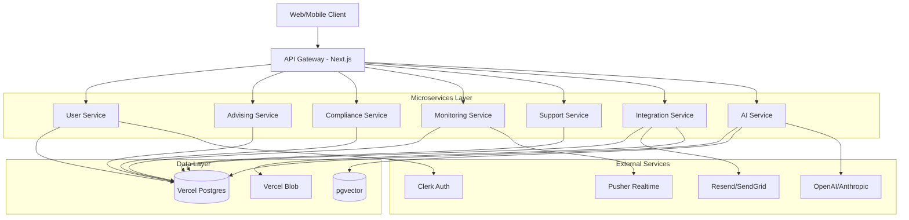
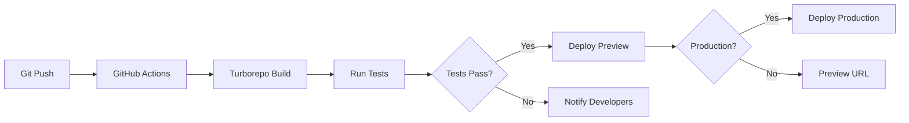
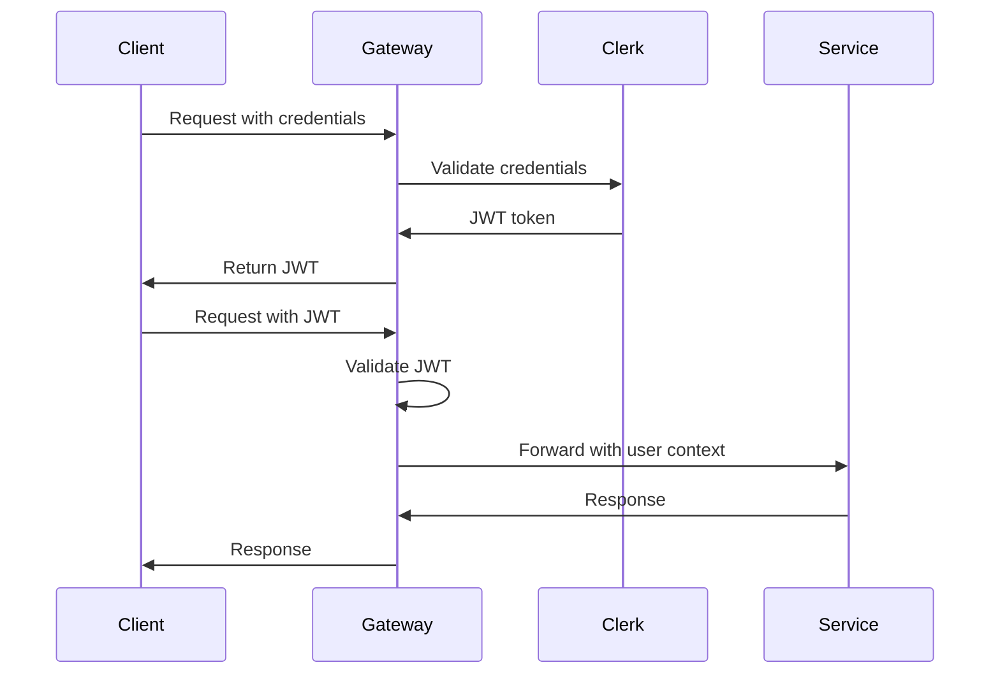

# Design Document

## Overview

This design document outlines the architecture for implementing a comprehensive microservices-based SaaS platform for the Athletic Academics Hub (AAH). The system follows the Vercel multi-zone microservices pattern, where each service is an independent Next.js or Hono application deployed as Vercel Serverless Functions, all unified under a single domain.

The architecture prioritizes:
- **Service Independence**: Each microservice can be developed, tested, and deployed independently
- **Scalability**: Auto-scaling serverless functions handle variable load
- **Type Safety**: Shared TypeScript types and Prisma schemas ensure consistency
- **Developer Experience**: Turborepo enables fast builds with intelligent caching
- **Security**: Centralized authentication with distributed authorization
- **Observability**: Comprehensive logging, monitoring, and tracing across services

## Architecture

### High-Level System Architecture



### Deployment Architecture

The system uses Vercel's multi-zone pattern where each microservice is deployed independently:

- **Frontend Zone**: Next.js app at `/` serving the main UI
- **Service Zones**: Each microservice at `/api/{service}/*` routes
- **Edge Functions**: Authentication middleware and caching at edge locations
- **Serverless Functions**: Business logic deployed as auto-scaling functions

### Service Communication Patterns

1. **Synchronous REST**: Primary communication method for request-response patterns
2. **Event-Driven**: Pusher WebSockets for real-time updates (alerts, notifications)
3. **Streaming**: Server-Sent Events (SSE) for AI chat responses
4. **Batch Processing**: Scheduled cron jobs via Vercel for periodic tasks

## Components and Interfaces

### 1. User Service

**Responsibility**: Authentication, authorization, user profile management, and RBAC

**Technology Stack**:
- Framework: Hono for lightweight API endpoints
- Database: Prisma with Vercel Postgres
- Auth Provider: Clerk for authentication
- Deployment: Vercel Serverless Functions

**API Endpoints**:
```typescript
POST   /api/user/register          // Create new user account
POST   /api/user/login             // Authenticate user (delegates to Clerk)
GET    /api/user/profile/:id       // Get user profile
PUT    /api/user/profile/:id       // Update user profile
GET    /api/user/roles/:id         // Get user roles and permissions
POST   /api/user/sync-clerk        // Webhook for Clerk user sync
```

**Key Components**:
- **AuthMiddleware**: Validates JWT tokens from Clerk
- **RBACService**: Manages role-based access control
- **ProfileService**: Handles user profile CRUD operations
- **ClerkSyncService**: Synchronizes Clerk users with local database

**Data Models**:
- User: Core user entity with Clerk integration
- StudentProfile: Extended profile for student-athletes
- UserRole: Enum for role-based access

### 2. Advising Service

**Responsibility**: Course selection, scheduling, conflict detection, degree progress tracking

**Technology Stack**:
- Framework: Hono
- Database: Prisma
- Integration: Calls AI Service for recommendations
- Deployment: Vercel Serverless Functions

**API Endpoints**:
```typescript
POST   /api/advising/schedule              // Generate course schedule
GET    /api/advising/conflicts/:studentId  // Check scheduling conflicts
POST   /api/advising/recommend             // Get course recommendations
GET    /api/advising/degree-progress/:id   // Track degree completion
POST   /api/advising/validate-schedule     // Validate proposed schedule
```

**Key Components**:
- **SchedulingEngine**: Generates conflict-free schedules
- **ConflictDetector**: Identifies conflicts with athletic commitments
- **DegreeAuditService**: Tracks progress toward degree requirements
- **RecommendationService**: Integrates with AI Service for intelligent suggestions

**Algorithms**:
- Constraint Satisfaction Problem (CSP) solver for scheduling
- Graph-based conflict detection
- Progress calculation based on degree requirements

### 3. Compliance Service

**Responsibility**: NCAA Division I eligibility validation, rule engine, audit logging

**Technology Stack**:
- Framework: Hono
- Database: Prisma
- Rule Engine: Custom TypeScript validation logic
- Deployment: Vercel Serverless Functions

**API Endpoints**:
```typescript
POST   /api/compliance/check-eligibility    // Validate student eligibility
GET    /api/compliance/status/:studentId    // Get current eligibility status
POST   /api/compliance/initial-eligibility  // Check initial eligibility (freshmen)
POST   /api/compliance/continuing           // Check continuing eligibility
GET    /api/compliance/violations/:id       // Get eligibility violations
POST   /api/compliance/update-rules         // Update NCAA rules (admin only)
GET    /api/compliance/audit-log/:studentId // Get compliance audit trail
```

**Key Components**:
- **RuleEngine**: Executes NCAA Division I eligibility rules
- **InitialEligibilityValidator**: Validates 16 core courses, 2.3 GPA, 10/7 rule
- **ContinuingEligibilityValidator**: Validates credit hours, GPA thresholds, progress-toward-degree
- **AuditLogger**: Records all eligibility checks for NCAA compliance
- **RuleConfigService**: Manages rule updates without code deployment

**Rule Validation Logic**:
```typescript
interface EligibilityRule {
  id: string
  name: string
  version: string
  validate: (student: StudentData) => ValidationResult
}

interface ValidationResult {
  isEligible: boolean
  violations: Violation[]
  warnings: Warning[]
  recommendations: string[]
}
```

### 4. Monitoring Service

**Responsibility**: Academic performance tracking, progress reports, early intervention alerts

**Technology Stack**:
- Framework: Hono
- Database: Prisma
- Real-time: Pusher for WebSocket notifications
- Integration: Calls AI Service for predictive analytics
- Deployment: Vercel Serverless Functions

**API Endpoints**:
```typescript
GET    /api/monitoring/performance/:studentId  // Get performance metrics
POST   /api/monitoring/progress-report         // Submit progress report
GET    /api/monitoring/alerts/:studentId       // Get active alerts
POST   /api/monitoring/intervention            // Create intervention plan
GET    /api/monitoring/analytics/team/:teamId  // Team-wide analytics
POST   /api/monitoring/risk-assessment         // Trigger risk assessment
```

**Key Components**:
- **PerformanceTracker**: Calculates GPA, credit hours, attendance metrics
- **AlertEngine**: Generates alerts based on performance thresholds
- **ProgressReportService**: Manages faculty progress report submissions
- **InterventionService**: Creates and tracks intervention plans
- **AnalyticsService**: Aggregates data for dashboards

**Alert Severity Levels**:
- CRITICAL: Immediate eligibility risk
- HIGH: Performance below thresholds
- MEDIUM: Trending toward risk
- LOW: Informational

### 5. Support Service

**Responsibility**: Tutoring, study halls, life skills workshops, peer mentoring

**Technology Stack**:
- Framework: Hono
- Database: Prisma
- Scheduling: Integration with calendar APIs
- Deployment: Vercel Serverless Functions

**API Endpoints**:
```typescript
POST   /api/support/tutoring/book           // Book tutoring session
GET    /api/support/tutoring/availability   // Check tutor availability
POST   /api/support/study-hall/checkin      // Check in to study hall
GET    /api/support/study-hall/attendance   // Get attendance records
POST   /api/support/workshop/register       // Register for workshop
GET    /api/support/mentoring/matches       // Get mentor matches
POST   /api/support/mentoring/session       // Schedule mentoring session
```

**Key Components**:
- **TutoringService**: Manages tutor bookings and availability
- **StudyHallService**: Tracks attendance and mandatory hours
- **WorkshopService**: Handles life skills workshop registration
- **MentoringService**: Matches students with peer mentors
- **AvailabilityEngine**: Optimizes scheduling based on constraints

### 6. Integration Service

**Responsibility**: External system integrations, faculty liaison, notifications

**Technology Stack**:
- Framework: Hono
- Email: Resend or SendGrid
- Calendar: Google Calendar and Outlook APIs
- File Storage: Vercel Blob
- Deployment: Vercel Serverless Functions

**API Endpoints**:
```typescript
POST   /api/integration/travel-letter       // Generate travel letter
POST   /api/integration/absence-notification // Send absence notification
POST   /api/integration/email/send          // Send email
POST   /api/integration/calendar/sync       // Sync calendar events
POST   /api/integration/lms/sync            // Sync with LMS (Canvas/Blackboard)
POST   /api/integration/sis/import          // Import SIS data
GET    /api/integration/transcript/:id      // Retrieve transcript
```

**Key Components**:
- **EmailService**: Handles email notifications via Resend/SendGrid
- **CalendarService**: Integrates with Google Calendar and Outlook
- **LMSConnector**: Syncs grades and assignments from LMS
- **SISConnector**: Imports enrollment and transcript data
- **TravelLetterGenerator**: Creates automated travel letters
- **TranscriptService**: Integrates with Parchment/NSC for transcripts

### 7. AI Service

**Responsibility**: Conversational AI, RAG pipelines, predictive analytics, intelligent agents

**Technology Stack**:
- Framework: Hono
- AI SDK: Vercel AI SDK
- LLM Providers: OpenAI (GPT-4, GPT-4-mini), Anthropic (Claude)
- Vector DB: pgvector in Vercel Postgres
- Embeddings: OpenAI text-embedding-3-large
- Observability: Langfuse or Helicone
- Deployment: Vercel Serverless Functions with streaming

**API Endpoints**:
```typescript
POST   /api/ai/chat                      // Send chat message (streaming)
GET    /api/ai/chat/history/:convId     // Get conversation history
POST   /api/ai/advising/recommend       // AI course recommendations
POST   /api/ai/compliance/analyze       // Natural language compliance query
POST   /api/ai/report/generate          // Generate AI-powered report
POST   /api/ai/predict/risk             // Predict student risk
POST   /api/ai/agent/task               // Submit agentic workflow
GET    /api/ai/agent/status/:taskId     // Check agent task status
POST   /api/ai/knowledge/search         // Semantic search knowledge base
POST   /api/ai/feedback                 // Submit AI response feedback
POST   /api/ai/embeddings/generate      // Generate embeddings (admin)
```

**Key Components**:
- **ChatService**: Manages conversational AI with streaming responses
- **RAGPipeline**: Retrieval Augmented Generation for knowledge-based queries
- **AdvisingAgent**: Intelligent course recommendation agent
- **ComplianceAgent**: NCAA rule interpretation and scenario analysis
- **PredictiveAnalytics**: ML models for risk assessment
- **AgentOrchestrator**: Manages agentic workflows
- **EmbeddingService**: Generates and manages vector embeddings
- **KnowledgeBaseService**: Manages vectorized knowledge documents

**RAG Pipeline Architecture**:
```typescript
interface RAGPipeline {
  // 1. Query understanding
  analyzeQuery(query: string): QueryIntent
  
  // 2. Retrieval
  retrieveContext(intent: QueryIntent): Document[]
  
  // 3. Reranking
  rerankDocuments(docs: Document[], query: string): Document[]
  
  // 4. Generation
  generateResponse(context: Document[], query: string): StreamingResponse
  
  // 5. Validation
  validateResponse(response: string, sources: Document[]): ValidationResult
}
```

## Data Models

### Core Entities

**User and Authentication**:
```prisma
model User {
  id        String   @id @default(cuid())
  clerkId   String   @unique
  email     String   @unique
  role      UserRole
  firstName String?
  lastName  String?
  aiOptIn   Boolean  @default(true)
  createdAt DateTime @default(now())
  updatedAt DateTime @updatedAt
}
```

**Student Profile**:
```prisma
model StudentProfile {
  id                String   @id @default(cuid())
  userId            String   @unique
  studentId         String   @unique
  sport             String
  gpa               Float?
  creditHours       Int      @default(0)
  eligibilityStatus String   @default("PENDING")
  athleticSchedule  Json?
}
```

**Compliance Records**:
```prisma
model ComplianceRecord {
  id              String   @id @default(cuid())
  studentId       String
  termGpa         Float
  cumulativeGpa   Float
  creditHours     Int
  progressPercent Float
  isEligible      Boolean
  violations      Json?
  ruleVersion     String
  checkedAt       DateTime @default(now())
}
```

**AI Conversations**:
```prisma
model Conversation {
  id        String   @id @default(cuid())
  userId    String
  title     String?
  status    String   @default("active")
  createdAt DateTime @default(now())
  messages  Message[]
}

model Message {
  id             String   @id @default(cuid())
  conversationId String
  role           String   // user, assistant, system
  content        String   @db.Text
  tokenCount     Int?
  modelUsed      String?
  timestamp      DateTime @default(now())
}
```

**Vector Embeddings**:
```prisma
model VectorEmbedding {
  id          String   @id @default(cuid())
  contentType String
  contentHash String   @unique
  embedding   Unsupported("vector(1536)")
  metadata    Json
  createdAt   DateTime @default(now())
}
```

## Error Handling

### Error Response Format

All services return consistent error responses:

```typescript
interface ErrorResponse {
  error: {
    code: string
    message: string
    details?: any
    timestamp: string
    requestId: string
  }
}
```

### Error Categories

1. **Authentication Errors** (401):
   - Invalid JWT token
   - Expired session
   - Missing authentication

2. **Authorization Errors** (403):
   - Insufficient permissions
   - Role-based access denied

3. **Validation Errors** (400):
   - Invalid input data
   - Missing required fields
   - Business rule violations

4. **Not Found Errors** (404):
   - Resource not found
   - Invalid endpoint

5. **Service Errors** (500):
   - Database connection failures
   - External API failures
   - Unexpected exceptions

### Error Handling Strategy

- **Graceful Degradation**: Services continue operating with reduced functionality
- **Circuit Breaker**: Prevent cascading failures in service dependencies
- **Retry Logic**: Exponential backoff for transient failures
- **Fallback Responses**: Default responses when services are unavailable
- **Centralized Logging**: All errors logged to Sentry with context

## Testing Strategy

### Unit Testing

- **Framework**: Jest with TypeScript
- **Coverage Target**: 80% code coverage
- **Focus Areas**:
  - Business logic in service classes
  - Rule validation algorithms
  - Data transformation functions
  - Utility functions

### Integration Testing

- **Framework**: Jest with Supertest for API testing
- **Database**: Test database with Prisma migrations
- **Focus Areas**:
  - API endpoint functionality
  - Database operations
  - Service-to-service communication
  - Authentication and authorization

### End-to-End Testing

- **Framework**: Cypress
- **Environment**: Vercel preview deployments
- **Focus Areas**:
  - Critical user flows
  - Multi-service workflows
  - UI interactions
  - Real-time features

### Performance Testing

- **Tools**: k6 or Artillery
- **Metrics**:
  - Response time < 200ms for API calls
  - AI first token < 500ms
  - Concurrent user capacity
  - Database query performance

### Security Testing

- **Tools**: OWASP ZAP, Snyk
- **Focus Areas**:
  - Authentication bypass attempts
  - SQL injection prevention
  - XSS prevention
  - FERPA compliance validation

## Deployment and Operations

### CI/CD Pipeline



### Monitoring and Observability

**Metrics Collection**:
- Vercel Analytics for performance metrics
- Custom metrics for business KPIs
- AI-specific metrics (token usage, latency, accuracy)

**Logging**:
- Structured JSON logs
- Correlation IDs for distributed tracing
- Log levels: DEBUG, INFO, WARN, ERROR

**Alerting**:
- Sentry for error tracking
- Custom alerts for business thresholds
- PagerDuty integration for critical issues

### Scaling Strategy

**Horizontal Scaling**:
- Vercel Serverless Functions auto-scale based on demand
- No manual intervention required

**Database Scaling**:
- Vercel Postgres connection pooling
- Read replicas for analytics queries
- Caching layer with Vercel KV (Redis)

**Cost Optimization**:
- Intelligent caching to reduce function invocations
- Token usage optimization for AI services
- Efficient database queries with Prisma

## Security Architecture

### Authentication Flow



### Data Protection

**Encryption**:
- TLS 1.3 for data in transit
- AES-256 encryption for sensitive data at rest
- Encrypted conversation history

**Access Control**:
- Role-based access control (RBAC)
- Attribute-based access control (ABAC) for fine-grained permissions
- Service-to-service authentication with API keys

**Audit Logging**:
- All data access logged with user ID and timestamp
- Immutable audit trail for compliance
- Regular audit log reviews

### FERPA Compliance

- Data minimization principles
- User consent tracking
- Data retention policies
- Right to access and correction
- Secure data deletion

## Performance Optimization

### Caching Strategy

**Edge Caching**:
- Static assets cached at CDN edge
- API responses cached with appropriate TTL
- Stale-while-revalidate for dynamic content

**Application Caching**:
- Vercel KV (Redis) for session data
- Query result caching with Prisma
- AI response caching for common queries

### Database Optimization

- Indexed columns for frequent queries
- Materialized views for complex analytics
- Connection pooling with PgBouncer
- Query optimization with EXPLAIN ANALYZE

### AI Performance

- Token usage optimization with caching
- Model selection based on query complexity
- Streaming responses for better UX
- Batch processing for embeddings

## Design Decisions and Rationales

### Why Microservices?

- **Independent Scaling**: Services scale based on individual demand
- **Team Autonomy**: Teams can work independently on services
- **Technology Flexibility**: Each service can use optimal technologies
- **Fault Isolation**: Failures contained to individual services
- **Deployment Independence**: Deploy services without affecting others

### Why Vercel?

- **Zero Configuration**: Automatic deployments from Git
- **Global Edge Network**: Low latency worldwide
- **Serverless Auto-Scaling**: No infrastructure management
- **Integrated Ecosystem**: Database, storage, analytics included
- **Developer Experience**: Fast builds with Turborepo

### Why Hono for Services?

- **Lightweight**: Minimal overhead for serverless functions
- **Type-Safe**: Full TypeScript support
- **Fast**: Optimized for edge and serverless environments
- **Flexible**: Works with multiple runtimes

### Why Prisma?

- **Type Safety**: Generated TypeScript types
- **Migration Management**: Version-controlled schema changes
- **Developer Experience**: Intuitive query API
- **Performance**: Optimized queries with connection pooling

### Why pgvector?

- **Cost-Effective**: No separate vector database needed
- **Integrated**: Same database as application data
- **Performant**: Efficient similarity search
- **Scalable**: Can migrate to dedicated vector DB if needed

## Future Enhancements

### Phase 2 Features

- **Voice Interface**: Speech-to-text for mobile AI assistant
- **Advanced Analytics**: Predictive models for graduation likelihood
- **Automated Workflows**: Fully autonomous administrative agents
- **Multi-Language Support**: Internationalization for diverse student populations

### Scalability Improvements

- **Microservices Mesh**: Service mesh for advanced traffic management
- **Event-Driven Architecture**: Kafka or RabbitMQ for async communication
- **Dedicated Vector DB**: Pinecone or Qdrant for high-volume semantic search
- **Multi-Region Deployment**: Geographic distribution for global institutions

### AI Enhancements

- **Fine-Tuned Models**: Custom models trained on institutional data
- **Multi-Modal AI**: Image and document analysis capabilities
- **Sentiment Analysis**: Mental health monitoring through conversation analysis
- **Explainable AI**: Enhanced transparency in AI decision-making
