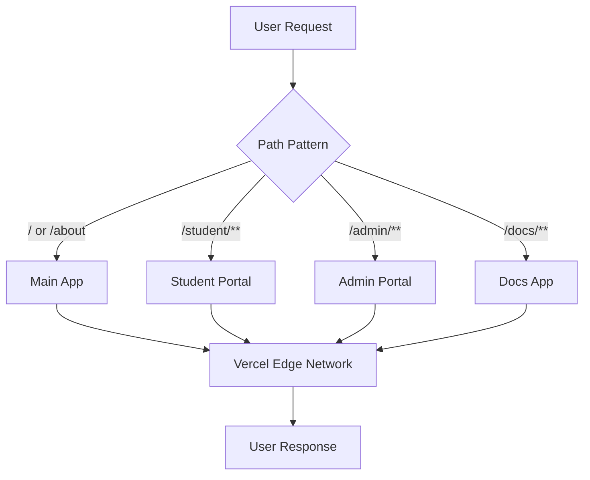
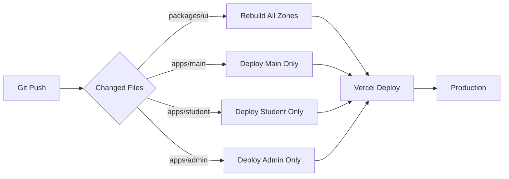

# Design Document

## Overview

The Multi-Zones microfrontends architecture transforms the Athletic Academics Hub from a single Next.js application into multiple independent Next.js applications that render on a common domain. This design enables parallel development by different teams while maintaining a unified user experience. The architecture leverages Vercel's Multi-Zones support, Turborepo for monorepo management, and shared packages for common functionality.

### Key Benefits

- **Team Independence**: Teams can develop, test, and deploy zones independently without coordination overhead
- **Faster Build Times**: Only affected zones rebuild when changes occur, reducing CI/CD time
- **Technology Flexibility**: Each zone can use different Next.js versions or configurations if needed
- **Scalability**: New zones can be added without modifying existing applications
- **Deployment Safety**: Issues in one zone don't prevent deployment of others

### Architecture Principles

1. **Domain Unity**: All zones serve from a single domain (e.g., athleticacademics.com)
2. **Independent Deployment**: Each zone deploys separately to Vercel
3. **Shared Foundation**: Common packages (UI, database, auth) ensure consistency
4. **Clear Boundaries**: Each zone owns specific route patterns (e.g., `/student/**`, `/admin/**`)
5. **Progressive Enhancement**: Cross-zone navigation uses prefetching to minimize perceived latency

## Architecture

### High-Level Structure

```
athleticacademics.com/
├── /                    → Main App (landing, marketing, legal)
├── /student/**          → Student Portal (dashboard, schedule, resources)
├── /admin/**            → Admin Portal (program management, analytics)
└── /docs/**             → Docs App (help, guides, API documentation)
```

### Zone Routing Flow



### Monorepo Structure

```
/
├── apps/
│   ├── main/                      # Main application (root domain)
│   │   ├── app/                   # Next.js App Router
│   │   ├── components/            # Main-specific components
│   │   ├── next.config.js         # Multi-Zones rewrites configuration
│   │   └── package.json
│   ├── student/                   # Student Portal (/student/**)
│   │   ├── app/
│   │   ├── components/
│   │   ├── middleware.ts          # Auth checks for student routes
│   │   ├── next.config.js
│   │   └── package.json
│   ├── admin/                     # Admin Portal (/admin/**)
│   │   ├── app/
│   │   ├── components/
│   │   ├── middleware.ts          # RBAC for admin routes
│   │   ├── next.config.js
│   │   └── package.json
│   └── docs/                      # Documentation (/docs/**)
│       ├── app/
│       ├── components/
│       ├── next.config.js
│       └── package.json
├── packages/
│   ├── ui/                        # Shared Design System
│   │   ├── components/
│   │   │   ├── button.tsx
│   │   │   ├── card.tsx
│   │   │   ├── cross-zone-link.tsx
│   │   │   └── ...
│   │   ├── styles/
│   │   │   └── globals.css
│   │   └── package.json
│   ├── database/                  # Shared Prisma schema
│   │   ├── prisma/
│   │   │   └── schema.prisma
│   │   ├── index.ts               # Prisma client export
│   │   └── package.json
│   ├── auth/                      # Shared Clerk utilities
│   │   ├── middleware.ts          # Auth middleware factory
│   │   ├── utils.ts               # Role checking utilities
│   │   └── package.json
│   ├── config/                    # Shared configurations
│   │   ├── eslint-config/
│   │   ├── tsconfig/
│   │   └── tailwind-config/
│   └── ai/                        # Existing AI package
├── services/                      # Existing microservices
│   └── ...
├── turbo.json                     # Turborepo pipeline configuration
├── package.json                   # Root workspace configuration
└── pnpm-workspace.yaml            # PNPM workspace definition
```

## Components and Interfaces

### 1. Main App Configuration

The Main App serves as the entry point and router for all zones.

**next.config.js**
```javascript
module.exports = {
  async rewrites() {
    return [
      {
        source: '/student',
        destination: `${process.env.STUDENT_PORTAL_URL}/student`,
      },
      {
        source: '/student/:path*',
        destination: `${process.env.STUDENT_PORTAL_URL}/student/:path*`,
      },
      {
        source: '/admin',
        destination: `${process.env.ADMIN_PORTAL_URL}/admin`,
      },
      {
        source: '/admin/:path*',
        destination: `${process.env.ADMIN_PORTAL_URL}/admin/:path*`,
      },
      {
        source: '/docs',
        destination: `${process.env.DOCS_APP_URL}/docs`,
      },
      {
        source: '/docs/:path*',
        destination: `${process.env.DOCS_APP_URL}/docs/:path*`,
      },
    ];
  },
  // Shared configuration
  transpilePackages: ['@aah/ui', '@aah/database', '@aah/auth'],
};
```

**Environment Variables (Development)**
```env
STUDENT_PORTAL_URL=http://localhost:3001
ADMIN_PORTAL_URL=http://localhost:3002
DOCS_APP_URL=http://localhost:3003
```

**Environment Variables (Production)**
```env
STUDENT_PORTAL_URL=https://athleticacademics.com
ADMIN_PORTAL_URL=https://athleticacademics.com
DOCS_APP_URL=https://athleticacademics.com
```

### 2. Zone Applications

Each zone is a complete Next.js application with its own configuration.

**Student Portal (apps/student/next.config.js)**
```javascript
module.exports = {
  basePath: '/student',
  transpilePackages: ['@aah/ui', '@aah/database', '@aah/auth'],
  async rewrites() {
    return {
      beforeFiles: [
        {
          source: '/student/:path*',
          destination: '/:path*',
        },
      ],
    };
  },
};
```

**Student Portal Middleware (apps/student/middleware.ts)**
```typescript
import { authMiddleware } from '@aah/auth';

export default authMiddleware({
  publicRoutes: [],
  afterAuth(auth, req) {
    // Ensure user is authenticated
    if (!auth.userId) {
      return redirectToSignIn({ returnBackUrl: req.url });
    }
    
    // Ensure user has student-athlete role
    if (!auth.sessionClaims?.role?.includes('student')) {
      return new Response('Unauthorized', { status: 403 });
    }
  },
});

export const config = {
  matcher: ['/((?!.+\\.[\\w]+$|_next).*)', '/', '/(api|trpc)(.*)'],
};
```

### 3. Shared Design System

The Design System provides consistent UI components across all zones.

**CrossZoneLink Component (packages/ui/components/cross-zone-link.tsx)**
```typescript
'use client';

import { useEffect, useRef } from 'react';
import Link from 'next/link';

interface CrossZoneLinkProps {
  href: string;
  children: React.ReactNode;
  prefetch?: boolean;
  openInNewTab?: boolean;
  className?: string;
}

export function CrossZoneLink({
  href,
  children,
  prefetch = true,
  openInNewTab = false,
  className,
}: CrossZoneLinkProps) {
  const linkRef = useRef<HTMLAnchorElement>(null);
  
  useEffect(() => {
    if (!prefetch || !linkRef.current) return;
    
    const observer = new IntersectionObserver(
      (entries) => {
        entries.forEach((entry) => {
          if (entry.isIntersecting) {
            // Prefetch the target zone
            const link = document.createElement('link');
            link.rel = 'prefetch';
            link.href = href;
            document.head.appendChild(link);
            
            observer.disconnect();
          }
        });
      },
      { rootMargin: '50px' }
    );
    
    observer.observe(linkRef.current);
    
    return () => observer.disconnect();
  }, [href, prefetch]);
  
  return (
    <a
      ref={linkRef}
      href={href}
      target={openInNewTab ? '_blank' : undefined}
      rel={openInNewTab ? 'noopener noreferrer' : undefined}
      className={className}
    >
      {children}
    </a>
  );
}
```

**Button Component (packages/ui/components/button.tsx)**
```typescript
import { forwardRef } from 'react';
import { cn } from '../utils';

interface ButtonProps extends React.ButtonHTMLAttributes<HTMLButtonElement> {
  variant?: 'primary' | 'secondary' | 'outline' | 'ghost';
  size?: 'sm' | 'md' | 'lg';
}

export const Button = forwardRef<HTMLButtonElement, ButtonProps>(
  ({ className, variant = 'primary', size = 'md', ...props }, ref) => {
    return (
      <button
        ref={ref}
        className={cn(
          'inline-flex items-center justify-center rounded-md font-medium transition-colors',
          'focus-visible:outline-none focus-visible:ring-2 focus-visible:ring-offset-2',
          'disabled:pointer-events-none disabled:opacity-50',
          {
            'bg-blue-600 text-white hover:bg-blue-700': variant === 'primary',
            'bg-gray-200 text-gray-900 hover:bg-gray-300': variant === 'secondary',
            'border border-gray-300 bg-transparent hover:bg-gray-100': variant === 'outline',
            'hover:bg-gray-100': variant === 'ghost',
          },
          {
            'h-8 px-3 text-sm': size === 'sm',
            'h-10 px-4': size === 'md',
            'h-12 px-6 text-lg': size === 'lg',
          },
          className
        )}
        {...props}
      />
    );
  }
);

Button.displayName = 'Button';
```

### 4. Shared Auth Package

**Auth Middleware Factory (packages/auth/middleware.ts)**
```typescript
import { authMiddleware as clerkAuthMiddleware } from '@clerk/nextjs';

export interface AuthMiddlewareOptions {
  publicRoutes?: string[];
  requiredRoles?: string[];
  afterAuth?: (auth: any, req: any) => Response | void;
}

export function authMiddleware(options: AuthMiddlewareOptions = {}) {
  return clerkAuthMiddleware({
    publicRoutes: options.publicRoutes || [],
    afterAuth: options.afterAuth,
  });
}

export function requireRole(roles: string[]) {
  return (auth: any) => {
    const userRoles = auth.sessionClaims?.role || [];
    return roles.some(role => userRoles.includes(role));
  };
}
```

### 5. Shared Database Package

**Prisma Client Export (packages/database/index.ts)**
```typescript
import { PrismaClient } from '@prisma/client';

const globalForPrisma = globalThis as unknown as {
  prisma: PrismaClient | undefined;
};

export const prisma =
  globalForPrisma.prisma ??
  new PrismaClient({
    log: process.env.NODE_ENV === 'development' ? ['query', 'error', 'warn'] : ['error'],
  });

if (process.env.NODE_ENV !== 'production') {
  globalForPrisma.prisma = prisma;
}

export * from '@prisma/client';
```

### 6. Turborepo Configuration

**turbo.json**
```json
{
  "$schema": "https://turbo.build/schema.json",
  "globalDependencies": ["**/.env.*local"],
  "pipeline": {
    "build": {
      "dependsOn": ["^build"],
      "outputs": [".next/**", "!.next/cache/**"]
    },
    "dev": {
      "cache": false,
      "persistent": true
    },
    "lint": {
      "dependsOn": ["^lint"]
    },
    "type-check": {
      "dependsOn": ["^type-check"]
    }
  }
}
```

**Root package.json Scripts**
```json
{
  "scripts": {
    "dev": "turbo run dev --parallel",
    "dev:main": "turbo run dev --filter=main",
    "dev:student": "turbo run dev --filter=student",
    "dev:admin": "turbo run dev --filter=admin",
    "dev:docs": "turbo run dev --filter=docs",
    "build": "turbo run build",
    "build:main": "turbo run build --filter=main...",
    "build:student": "turbo run build --filter=student...",
    "build:admin": "turbo run build --filter=admin...",
    "build:docs": "turbo run build --filter=docs...",
    "lint": "turbo run lint",
    "type-check": "turbo run type-check"
  }
}
```

## Data Models

The existing Prisma schema remains unchanged. All zones share the same database through the `@aah/database` package.

### Zone-Specific Data Access Patterns

**Student Portal**: Queries filtered by authenticated student's ID
```typescript
// apps/student/lib/queries.ts
import { prisma } from '@aah/database';
import { auth } from '@clerk/nextjs';

export async function getStudentDashboard() {
  const { userId } = auth();
  
  return prisma.user.findUnique({
    where: { clerkId: userId },
    include: {
      courses: true,
      sessions: { where: { status: 'scheduled' } },
      complianceRecords: { orderBy: { createdAt: 'desc' }, take: 1 },
    },
  });
}
```

**Admin Portal**: Queries with role-based filtering
```typescript
// apps/admin/lib/queries.ts
import { prisma } from '@aah/database';
import { auth } from '@clerk/nextjs';
import { requireRole } from '@aah/auth';

export async function getAllStudents() {
  const { sessionClaims } = auth();
  
  if (!requireRole(['admin', 'staff'])(sessionClaims)) {
    throw new Error('Unauthorized');
  }
  
  return prisma.user.findMany({
    where: { role: 'student' },
    include: {
      complianceRecords: { orderBy: { createdAt: 'desc' }, take: 1 },
    },
  });
}
```

## Error Handling

### Cross-Zone Navigation Errors

**Error Boundary (packages/ui/components/zone-error-boundary.tsx)**
```typescript
'use client';

import { useEffect } from 'react';
import { Button } from './button';

export function ZoneErrorBoundary({
  error,
  reset,
}: {
  error: Error & { digest?: string };
  reset: () => void;
}) {
  useEffect(() => {
    console.error('Zone loading error:', error);
  }, [error]);

  return (
    <div className="flex min-h-screen items-center justify-center">
      <div className="text-center">
        <h2 className="text-2xl font-bold mb-4">Something went wrong</h2>
        <p className="text-gray-600 mb-6">
          We're having trouble loading this section. Please try again.
        </p>
        <Button onClick={reset}>Try Again</Button>
      </div>
    </div>
  );
}
```

### Zone Health Checks

**Health Check API (apps/main/app/api/health/route.ts)**
```typescript
import { NextResponse } from 'next/server';

export async function GET() {
  const zones = [
    { name: 'student', url: process.env.STUDENT_PORTAL_URL },
    { name: 'admin', url: process.env.ADMIN_PORTAL_URL },
    { name: 'docs', url: process.env.DOCS_APP_URL },
  ];

  const healthChecks = await Promise.all(
    zones.map(async (zone) => {
      try {
        const response = await fetch(`${zone.url}/api/health`, {
          signal: AbortSignal.timeout(5000),
        });
        return {
          zone: zone.name,
          status: response.ok ? 'healthy' : 'unhealthy',
          responseTime: response.headers.get('x-response-time'),
        };
      } catch (error) {
        return {
          zone: zone.name,
          status: 'unreachable',
          error: error.message,
        };
      }
    })
  );

  const allHealthy = healthChecks.every((check) => check.status === 'healthy');

  return NextResponse.json(
    { zones: healthChecks, overall: allHealthy ? 'healthy' : 'degraded' },
    { status: allHealthy ? 200 : 503 }
  );
}
```

## Testing Strategy

### Unit Testing

Each zone maintains its own test suite using Jest and React Testing Library.

**Example Test (apps/student/components/dashboard.test.tsx)**
```typescript
import { render, screen } from '@testing-library/react';
import { Dashboard } from './dashboard';

jest.mock('@aah/database', () => ({
  prisma: {
    user: {
      findUnique: jest.fn().mockResolvedValue({
        id: '1',
        name: 'Test Student',
        courses: [],
      }),
    },
  },
}));

describe('Dashboard', () => {
  it('renders student name', async () => {
    render(<Dashboard />);
    expect(await screen.findByText('Test Student')).toBeInTheDocument();
  });
});
```

### Integration Testing

Test cross-zone navigation and shared package integration.

**Example Integration Test (tests/integration/cross-zone-navigation.test.ts)**
```typescript
import { test, expect } from '@playwright/test';

test('navigate from main to student portal', async ({ page }) => {
  await page.goto('/');
  await page.click('a[href="/student"]');
  
  // Wait for full page load (cross-zone navigation)
  await page.waitForLoadState('networkidle');
  
  expect(page.url()).toContain('/student');
  expect(await page.title()).toContain('Student Portal');
});
```

### End-to-End Testing

Use Playwright to test complete user flows across zones.

**Example E2E Test (tests/e2e/student-workflow.test.ts)**
```typescript
import { test, expect } from '@playwright/test';

test('student can view schedule and book tutoring', async ({ page }) => {
  // Login
  await page.goto('/');
  await page.click('text=Sign In');
  // ... authentication flow
  
  // Navigate to student portal
  await page.goto('/student/dashboard');
  await expect(page.locator('h1')).toContainText('Dashboard');
  
  // View schedule
  await page.click('text=Schedule');
  await expect(page).toHaveURL('/student/schedule');
  
  // Book tutoring session
  await page.click('text=Book Tutoring');
  await page.fill('input[name="subject"]', 'Math');
  await page.click('button[type="submit"]');
  
  await expect(page.locator('.success-message')).toBeVisible();
});
```

## Deployment Strategy

### Vercel Configuration

Each zone deploys as a separate Vercel project with specific configuration.

**Main App (vercel.json)**
```json
{
  "buildCommand": "cd ../.. && pnpm build:main",
  "installCommand": "pnpm install",
  "framework": "nextjs",
  "outputDirectory": ".next"
}
```

**Student Portal (vercel.json)**
```json
{
  "buildCommand": "cd ../.. && pnpm build:student",
  "installCommand": "pnpm install",
  "framework": "nextjs",
  "outputDirectory": ".next"
}
```

### Environment Variables per Zone

**Main App**
- `NEXT_PUBLIC_CLERK_PUBLISHABLE_KEY`
- `CLERK_SECRET_KEY`
- `STUDENT_PORTAL_URL`
- `ADMIN_PORTAL_URL`
- `DOCS_APP_URL`
- `DATABASE_URL`

**Student Portal**
- `NEXT_PUBLIC_CLERK_PUBLISHABLE_KEY`
- `CLERK_SECRET_KEY`
- `DATABASE_URL`

**Admin Portal**
- `NEXT_PUBLIC_CLERK_PUBLISHABLE_KEY`
- `CLERK_SECRET_KEY`
- `DATABASE_URL`
- `SENTRY_DSN` (admin-specific monitoring)

### Deployment Workflow



### Rollback Strategy

Since zones deploy independently, rollbacks can be performed per zone without affecting others.

```bash
# Rollback student portal only
vercel rollback student-portal --to=previous

# Rollback all zones to specific deployment
vercel rollback main --to=dpl_abc123
vercel rollback student --to=dpl_def456
vercel rollback admin --to=dpl_ghi789
```

## Performance Considerations

### Build Optimization

- **Turborepo Caching**: Reuse build outputs when dependencies haven't changed
- **Incremental Builds**: Only rebuild affected zones
- **Parallel Builds**: Build independent zones simultaneously

### Runtime Optimization

- **Edge Caching**: Leverage Vercel Edge Network for static assets
- **Prefetching**: Use CrossZoneLink component for proactive loading
- **Code Splitting**: Each zone bundles only its required code
- **Shared Chunks**: Common dependencies cached across zones

### Monitoring

- **Zone-Specific Metrics**: Track performance per zone in Vercel Analytics
- **Cross-Zone Navigation Timing**: Monitor full page refresh latency
- **Health Check Dashboard**: Real-time zone availability status
- **Build Time Tracking**: Monitor Turborepo cache hit rates

## Migration Path

### Phase 1: Setup Infrastructure (Week 1)

1. Configure Turborepo in existing monorepo
2. Create shared packages structure
3. Extract common components to `@aah/ui`
4. Setup Multi-Zones rewrites in main app

### Phase 2: Create Zone Applications (Week 2-3)

1. Create `apps/student` with student-specific routes
2. Create `apps/admin` with admin-specific routes
3. Create `apps/docs` for documentation
4. Migrate routes from existing `apps/web` to appropriate zones

### Phase 3: Testing & Validation (Week 4)

1. Implement cross-zone navigation tests
2. Validate authentication across zones
3. Performance testing and optimization
4. User acceptance testing

### Phase 4: Deployment (Week 5)

1. Deploy zones to Vercel staging
2. Configure production environment variables
3. Production deployment with gradual rollout
4. Monitor and iterate based on feedback
