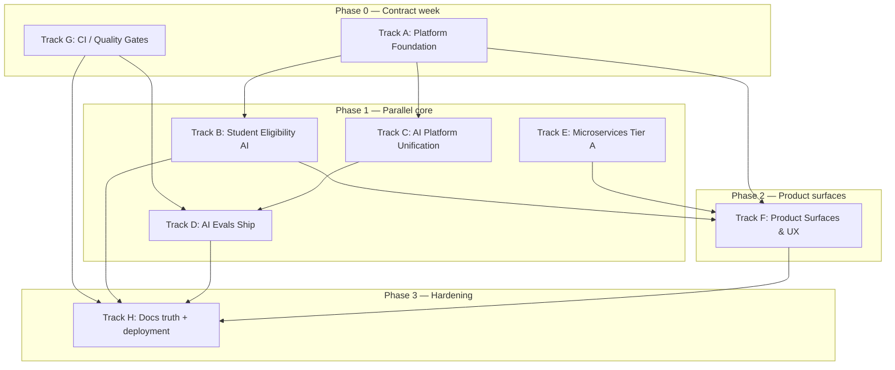

# Post-Upgrade Refactor & Feature Plan

**Status:** Proposed (May 2026)  
**Baseline:** Tech stack upgrade merged on `main` ([`docs/upgrades/TECH_STACK_UPGRADE.md`](../../upgrades/TECH_STACK_UPGRADE.md))  
**Goal:** Turn the upgraded stack into a coherent, PRD-aligned product with parallel agent execution, isolated git worktrees, and phase-gated verification.

---

## 1. Current state (post-upgrade)

### What is solid

| Layer | State |
| --- | --- |
| Toolchain | pnpm 10, Node 22 CI, TS 5.9, Jest 30 |
| Apps build | `@aah/main`, `@aah/student`, `@aah/admin` pass `pnpm build` |
| Type-check | 14 packages pass `pnpm type-check` |
| Prisma 7 | Shared client via `@aah/database`, pg adapter, generated client |
| AI SDK 6 | Unified `ai ^6.0.191`; `packages/ai` agents migrated |
| Regulation Watch | Cron + compliance UI + coach updates largely wired |

### What is incomplete (highest risk)

| Gap | Impact | Key paths |
| --- | --- | --- |
| **Student AI bypasses PRD v2.2 guard** | Compliance / legal risk | `apps/student/app/api/ai/chat/route.ts` vs `services/ai/src/services/eligibilityResponseGuard.ts` |
| **Auth fragmentation** | Broken sign-in, wrong redirects, role case bugs | `apps/*/middleware.ts`, `packages/auth/middleware/nextjs.ts` |
| **Dual admin portals** | Mock UI in main vs real CRUD in admin app | `apps/main/app/admin/**`, `apps/admin/**` |
| **Tailwind token drift** | Broken shadcn classes on main | `apps/main/app/globals.css` missing semantic tokens |
| **Eval framework not shipped** | CLI runs mock results | `packages/ai-evals/src/cli/commands/run.ts` |
| **Split AI stack in services** | LangChain + AI SDK coexist | `services/ai/src/services/ragPipeline.ts` et al. |
| **Dead crons in Vercel** | 3/4 cron paths 404/401 | `vercel.json`, `apps/main/vercel.json` |
| **Legacy ESLint / Tailwind 3 artifacts** | Inconsistent lint/design | `apps/*/.eslintrc.*`, `packages/config/tailwind/base.js` |

---

## 2. Execution model: parallel agents + worktrees

### Principles

1. **One worktree per track** — avoid cross-track file contention.
2. **Phase gates** — no track starts Phase N+1 until its gate passes.
3. **Shared contracts first** — auth roles, BFF URLs, and design tokens land before feature tracks consume them.
4. **Skills before improvisation** — each agent loads the listed skill(s) before coding.
5. **Verification is part of the task** — every PR includes command output, not just code.

### Worktree bootstrap (orchestrator / human)

```bash
# From repo root on latest main
git fetch origin main && git checkout main && git pull origin main

WORKTREES_ROOT="${WORKTREES_ROOT:-../aah-worktrees}"
mkdir -p "$WORKTREES_ROOT"

declare -A TRACKS=(
  [platform]="cursor/refactor-platform-foundation-2db0"
  [student-ai]="cursor/refactor-student-eligibility-ai-2db0"
  [ai-platform]="cursor/refactor-ai-unification-2db0"
  [evals]="cursor/refactor-ai-evals-ship-2db0"
  [services]="cursor/refactor-microservices-tier-a-2db0"
  [product]="cursor/refactor-product-surfaces-2db0"
  [quality]="cursor/refactor-ci-quality-gates-2db0"
)

for name in "${!TRACKS[@]}"; do
  branch="${TRACKS[$name]}"
  path="$WORKTREES_ROOT/$name"
  git worktree add -b "$branch" "$path" main 2>/dev/null || git worktree add "$path" "$branch"
  (cd "$path" && pnpm install && pnpm db:generate)
done
```

Use skill: **`.claude/skills/ce-worktree`** (or `using-git-worktrees`) when creating worktrees in Cursor Cloud.

### Agent orchestration map



### Merge order (minimize conflicts)

| Order | Track | Branch prefix | Depends on |
| --- | --- | --- | --- |
| 1 | G — CI / quality | `cursor/refactor-ci-quality-gates-2db0` | — |
| 2 | A — Platform foundation | `cursor/refactor-platform-foundation-2db0` | G (optional) |
| 3 | E — Microservices | `cursor/refactor-microservices-tier-a-2db0` | A (auth/env contracts) |
| 4 | C — AI unification | `cursor/refactor-ai-unification-2db0` | A |
| 5 | B — Student eligibility AI | `cursor/refactor-student-eligibility-ai-2db0` | A, C |
| 6 | D — AI evals | `cursor/refactor-ai-evals-ship-2db0` | C |
| 7 | F — Product surfaces | `cursor/refactor-product-surfaces-2db0` | A, B, E |
| 8 | H — Docs + deploy | `cursor/refactor-docs-deploy-2db0` | All |

---

## 3. Phase gates (all tracks)

Every track PR must pass:

```bash
pnpm install
pnpm db:generate
pnpm type-check
pnpm build
pnpm lint
pnpm test
```

Track-specific gates are listed per track below.

---

## Track A — Platform foundation (auth, design system, admin strategy)

**Worktree:** `../aah-worktrees/platform`  
**Branch:** `cursor/refactor-platform-foundation-2db0`  
**Primary owners:** 1 orchestrator + 2 subagents (auth, design-system)

### Scope

| Work item | Details | Files |
| --- | --- | --- |
| **A1 — Unify Clerk 7 middleware** | Single pattern: native `clerkMiddleware` + `createRouteMatcher`; zone-aware public routes | `packages/auth/middleware/nextjs.ts`, `apps/*/middleware.ts` |
| **A2 — Fix role normalization** | Map Clerk/Prisma `UserRole` consistently (uppercase enum end-to-end) | `packages/auth/**`, `services/user/src/utils/roleMapping.ts` |
| **A3 — Zone-aware sign-in** | Student/admin sign-in routes + public middleware entries; fix basePath redirects | `apps/student/app/sign-in/**`, `apps/admin/middleware.ts`, `apps/student/app/page.tsx` |
| **A4 — Admin portal decision** | **Recommend:** deprecate mock `apps/main/app/admin/**`; redirect zone to standalone `@aah/admin` | `apps/main/next.config.js`, `apps/main/app/admin/**` |
| **A5 — Tailwind 4 consolidation** | Shared `@aah/ui/styles/app.css`; define semantic tokens on main; remove triplicate globals | `packages/ui/styles/**`, `apps/*/app/globals.css`, delete `packages/config/tailwind/base.js` usage |
| **A6 — ESLint 9 repo-wide** | Delete legacy `.eslintrc.*`; shared flat config in `packages/config/eslint/` | `packages/config/eslint/**`, `apps/*/eslint.config.mjs` |
| **A7 — Shared app shell** | Extract `ClerkProvider` + providers + error boundaries | new `packages/ui/app-shell/` or `@aah/auth/providers` |

### Skills & MCP

| Tool | Use |
| --- | --- |
| Skill: **Clerk** (`clerk-nextjs-patterns`, `clerk-webhooks`) | Middleware, async auth, orgs (admin) |
| Skill: **nextjs** | `forbidden.tsx` / `unauthorized.tsx`, layout patterns |
| Skill: **shadcn** + **ce-frontend-design** | Token consolidation, visual QA |
| MCP: **Clerk** (`clerk_sdk_snippet`) | Middleware and custom flow snippets |
| Subagent: **ce-julik-frontend-races-reviewer** | Middleware + client auth race review |

### Gate

- Manual: sign-in works on main (`:3000`), student (`:3001/student`), admin (`:3002/admin`)
- `pnpm --filter @aah/main --filter @aah/student --filter @aah/admin build`
- No legacy `.eslintrc.*` in apps

### PR title

`refactor(platform): unify Clerk 7 auth, Tailwind tokens, and admin strategy`

---

## Track B — Student eligibility AI (PRD v2.2)

**Worktree:** `../aah-worktrees/student-ai`  
**Branch:** `cursor/refactor-student-eligibility-ai-2db0`  
**Blocks:** production student chat  
**Depends on:** Track A (auth), Track C (AI service contract)

### Scope

| Work item | Details | Files |
| --- | --- | --- |
| **B1 — Route student chat through BFF** | Replace local edge route with proxy to `services/ai` (or main BFF `/api/ai/*`) | `apps/student/app/api/ai/chat/route.ts`, `apps/main/app/api/ai/[...path]/route.ts` |
| **B2 — Enforce buffered student responses** | Non-streaming path when `userRole === 'STUDENT'` | `services/ai/src/services/chatService.ts` |
| **B3 — Wire eligibility guard** | Run `eligibilityResponseGuard` before any client-visible output | `services/ai/src/services/eligibilityResponseGuard.ts` |
| **B4 — Student context injection** | `studentEligibilityContext` from Prisma snapshot | `services/ai/src/services/**` |
| **B5 — Audit logging** | Persist eligibility turns to `AIAuditLog` | `services/ai/**`, `packages/database` |
| **B6 — UI alignment** | Keep `StudentEligibilityDisclaimer`; add forbidden-phrase regression tests | `packages/ui/components/chat/**`, `apps/student/hooks/use-student-chat.ts` |
| **B7 — Update plan docs** | Mark epic status accurately | `docs/plans/student-facing-eligibility-ai/**` |

### Skills & MCP

| Tool | Use |
| --- | --- |
| Skill: **ai-sdk** | Buffered chat, transport, tool calling |
| Skill: **verification** | End-to-end: browser → API → guard → response |
| Skill: **ce-debug** | Trace guard failures |
| Subagent: **ce-correctness-reviewer** + **ce-security-reviewer** | Guard bypass scenarios |
| MCP: **browser-automation** (optional) | Student `/chat` smoke |

### Gate

```bash
pnpm --filter @aah/service-ai test   # eligibilityResponseGuard tests green
# Manual: student asks "Am I eligible?" → no definitive eligible/ineligible/cleared verdict
```

Forbidden output phrases: see `docs/prd.md` v2.2 acceptance criteria.

### PR title

`feat(student-ai): PRD v2.2 eligibility guard on student chat path`

---

## Track C — AI platform unification

**Worktree:** `../aah-worktrees/ai-platform`  
**Branch:** `cursor/refactor-ai-unification-2db0`

### Scope

| Work item | Details | Files |
| --- | --- | --- |
| **C1 — LangChain → AI SDK 6** | Migrate RAG, advising, compliance agents in service layer | `services/ai/src/services/ragPipeline.ts`, `advisingAgent.ts`, `complianceAgent.ts`, `predictiveAnalytics.ts` |
| **C2 — Connect package RAG to pgvector** | Replace stub `vectorSearch()` | `packages/ai/lib/rag.ts`, `services/ai/src/services/embeddingService.ts` |
| **C3 — Wire agent tools to microservices** | Resolve TODO stubs in compliance/advising tools | `packages/ai/tools/compliance-tools.ts`, `advising-tools.ts` |
| **C4 — Remove dead LangChain deps** | Drop unused `@langchain/*` from `packages/ai` after migration | `packages/ai/package.json` |
| **C5 — Enable feedback manager** | Fix schema alignment; re-export from `@aah/ai` | `packages/ai/lib/feedback-manager.ts`, `packages/ai/index.ts` |
| **C6 — Regulation watch → RAG** | Index regulation snapshots for AI retrieval | `services/compliance/src/regulation/**`, `services/ai` ingestion job |

### Skills & MCP

| Tool | Use |
| --- | --- |
| Skill: **ai-sdk** + **ai-architect** | Provider routing, RAG, agents |
| Skill: **senior-backend** | Service boundaries, pgvector |
| Subagent: **docs-researcher** (Context7 CLI) | `/vercel/ai`, migration notes |
| Subagent: **ce-performance-reviewer** | Embedding + retrieval latency |

### Gate

- `pnpm --filter @aah/ai --filter @aah/service-ai type-check test build`
- Single AI stack: no LangChain imports under `services/ai/src`

### PR title

`refactor(ai): unify on AI SDK 6 and wire tools/RAG to services`

---

## Track D — Ship AI evals framework

**Worktree:** `../aah-worktrees/evals`  
**Branch:** `cursor/refactor-ai-evals-ship-2db0`

### Scope

| Work item | Details | Files |
| --- | --- | --- |
| **D1 — Wire CLI run → orchestrator → DB** | Replace `mockResults` in run command | `packages/ai-evals/src/cli/commands/run.ts`, `orchestrator/**`, `db/repository.ts` |
| **D2 — Delete legacy runners** | Remove `src/base-runner.ts`, `specialized-runners.ts`; orchestrator uses `runners/*` | `packages/ai-evals/src/**` |
| **D3 — Modular scorers** | Remove `@ts-nocheck` monolith; use `src/scorers/` | `packages/ai-evals/src/scorers.ts` → migrate/delete |
| **D4 — Compliance + adversarial configs** | Gate student AI on eval thresholds | `packages/ai-evals/datasets/compliance/**`, `datasets/adversarial/**`, `examples/*.yaml` |
| **D5 — CI integration** | Hard-fail ai-evals in main CI (remove `continue-on-error`) | `.github/workflows/ai-evals.yml`, `ci.yml` |
| **D6 — Truthful docs** | Update completion claims | `packages/ai-evals/IMPLEMENTATION_*.md`, `docs/reports/**` |

### Skills & MCP

| Tool | Use |
| --- | --- |
| Skill: **senior-qa** + **ce-test-browser** | Eval scenarios, regression gates |
| Skill: **ce-optimize** (optional) | Scorer quality loops |
| Subagent: **ce-kieran-typescript-reviewer** | Runner/scorer types |
| MCP: **Opsera** (security-scan) | Before enabling automated eval runs in CI |

### Gate

```bash
pnpm --filter @aah/ai-evals type-check test
pnpm --filter @aah/ai-evals cli eval -- --config examples/compliance-eval.yaml  # real DB write
```

### PR title

`feat(evals): wire orchestrator to CLI and Prisma; add compliance eval gates`

---

## Track E — Microservices Tier A normalization

**Worktree:** `../aah-worktrees/services`  
**Branch:** `cursor/refactor-microservices-tier-a-2db0`

### Scope

| Work item | Details | Files |
| --- | --- | --- |
| **E1 — Tier B → Tier A template** | Auth, correlation ID, rate limit, `validateEnv`, structured logging | `services/ai`, `monitoring`, `integration`, `support` `src/index.ts` |
| **E2 — Consolidate validation middleware** | Delete duplicates; use `@aah/api-utils` | `services/support/src/middleware/validation.ts`, `services/user/src/middleware/validation.ts` |
| **E3 — Compliance rule engine cleanup** | One engine; delete unmounted orphan routes | `services/compliance/src/routes/eligibility.ts`, `services/ruleEngine.ts` vs `rules-engine.ts` |
| **E4 — Implement or remove dead crons** | `compliance-check`, `risk-assessment`, `sync-lms` | `apps/main/app/api/cron/**`, `vercel.json` |
| **E5 — Shared Hono context types** | Extend `packages/auth/types/hono.ts` + `api-utils` | already started; finish adoption |

Reference implementation: `services/compliance/src/index.ts`, `services/advising/src/index.ts`.

### Skills & MCP

| Tool | Use |
| --- | --- |
| Skill: **senior-backend** + **routing-middleware** | Hono middleware chain |
| Subagent: **ce-api-contract-reviewer** | Route/request stability |
| Subagent: **ce-reliability-reviewer** | Cron + retry behavior |
| MCP: **Opsera** (compliance-audit) | SOC2-oriented control gaps |

### Gate

- All 7 services pass `type-check` + `build`
- No `export default app` without `{ port, fetch }` pattern
- Cron smoke: only declared crons return 200 with bearer secret

### PR title

`refactor(services): normalize Tier A middleware and compliance engine`

---

## Track F — Product surfaces (replace mocks, modern Next/React)

**Worktree:** `../aah-worktrees/product`  
**Branch:** `cursor/refactor-product-surfaces-2db0`  
**Depends on:** A, B, E

### Scope

| Work item | PRD ref | Details |
| --- | --- | --- |
| **F1 — Student dashboard real data** | §6.1.1 | Wire tutoring, study hall, workshops to `services/support` | `apps/student/components/*-section.tsx` |
| **F2 — Schedule UX** | §6.1.1 | Real calendar events from enrollments + conflicts via advising | `schedule-calendar-view.tsx`, `services/advising` |
| **F3 — Compliance rule admin** | §6.1.6 | CRUD for `ComplianceRule` in admin app | `apps/admin/**` |
| **F4 — Monitoring dashboards** | §6.1.9 | Staff views for alerts, risk, interventions | `apps/main` or new admin sections |
| **F5 — Next 16 cache components** | — | `"use cache"` on read-heavy lists (compliance changes, admin analytics) | `apps/main/app/compliance/page.tsx`, `apps/admin/app/dashboard/page.tsx` |
| **F6 — React 19 forms** | — | `useActionState` on acknowledge + student forms | `acknowledge-form.tsx`, `StudentForm.tsx` |
| **F7 — Transfer credit MVP** | Planned epic | Implement phase 1 from `docs/plans/transfer-credit-system/` | TBD after admin strategy (A4) |

### Skills & MCP

| Tool | Use |
| --- | --- |
| Skill: **next-cache-components** | PPR / `use cache` / `cacheTag` |
| Skill: **senior-frontend** + **ce-frontend-design** | Dashboard UX |
| Skill: **product-manager-toolkit** | Prioritize F7 vs F1–F4 |
| Subagent: **ce-design-implementation-reviewer** | UI fidelity |
| MCP: **browser-automation** | Dashboard smoke screenshots |

### Gate

- No `mock*` imports in student dashboard path
- Playwright smoke (Track G) passes for student schedule + admin students CRUD

### PR title

`feat(product): replace mock surfaces and adopt Next 16 cache patterns`

---

## Track G — CI, testing, and quality gates

**Worktree:** `../aah-worktrees/quality`  
**Branch:** `cursor/refactor-ci-quality-gates-2db0`  
**Run early** (parallel with Track A)

### Scope

| Work item | Details |
| --- | --- |
| **G1 — Student/admin test scripts** | Add Jest or Vitest + minimal smoke unit tests |
| **G2 — Playwright product smoke** | Replace example spec with main/student/admin flows | `tests/e2e/**`, `playwright.config.ts` |
| **G3 — PRD v2.2 regression test** | API test: student role → forbidden phrases absent | new `services/ai/src/services/__tests__/student-eligibility.integration.test.ts` |
| **G4 — Vitest consolidation plan** | Migrate `packages/ai` off Jest/Vitest mix; enable `vitest-stack.yml` | `packages/ai/**`, `.github/workflows/vitest-stack.yml` |
| **G5 — ai-evals dataset validation** | CI step: validate JSON datasets | `packages/ai-evals/datasets/**` |
| **G6 — Pre-commit alignment** | `lint-staged` uses flat ESLint config | root `package.json` |

### Skills & MCP

| Tool | Use |
| --- | --- |
| Skill: **ce-test-browser** + **run-smoke-tests** | Playwright CI |
| Skill: **fix-ci** + **loop-on-ci** | Green main branch |
| Skill: **verification-before-completion** | Evidence before merge |
| Subagent: **ci-watcher** | Monitor PR checks |

### Gate

- GitHub Actions green on integration branch
- Playwright runs in CI (headless, no external secrets where possible)

### PR title

`ci: add Playwright smoke, student/admin tests, and eval dataset validation`

---

## Track H — Documentation truth & deployment alignment

**Worktree:** `../aah-worktrees/docs-deploy`  
**Branch:** `cursor/refactor-docs-deploy-2db0`  
**Run last** (depends on feature tracks)

### Scope

| Work item | Details |
| --- | --- |
| **H1 — Reconcile deployment docs** | Single source of truth: which apps deploy to Vercel | `docs/architecture/DEPLOYMENT.md`, root + `apps/main/vercel.json` |
| **H2 — Student/admin deploy strategy** | Separate Vercel projects or multi-zone doc | new `docs/guides/MULTI_APP_DEPLOY.md` |
| **H3 — Update onboarding docs** | Match upgraded stack | `docs/root/README.md`, `AGENTS.md` |
| **H4 — PRD traceability matrix** | §6 features → route/service mapping | `docs/reports/prd-traceability.md` |
| **H5 — Gap analysis refresh** | Close P0 doc truth items | `docs/reports/requirements-gap-analysis-remediation-plan.md` |

### Skills & MCP

| Tool | Use |
| --- | --- |
| Skill: **ce-compound** | Capture learnings to `docs/solutions/` |
| Skill: **deployment-expert** + **vercel-cli** | Deploy topology |
| Subagent: **ce-repo-research-analyst** | Doc/code drift audit |

### PR title

`docs: post-upgrade truth pass and deployment alignment`

---

## 4. Subagent dispatch cheat sheet

Use this when orchestrating Cursor Cloud / local agents:

| Task shape | Subagent | Skill |
| --- | --- | --- |
| Auth/middleware change | `generalPurpose` + **Clerk** skill | `clerk-nextjs-patterns` |
| AI migration | `generalPurpose` + **ai-sdk** skill | `verification` |
| Large codebase search | `explore` (medium/very thorough) | — |
| PR readiness | `code-reviewer` | `review-and-ship` |
| Security-sensitive diff | `devsecops` or **ce-security-sentinel** | `security-scan` |
| UI feature | `generalPurpose` | `ce-frontend-design` |
| Eval runner work | `generalPurpose` | `senior-qa` |
| CI red | `ci-watcher` | `fix-ci` |
| Post-merge learnings | `agents-memory-updater` | `ce-compound` |

### Parallel batch example (Phase 1 kickoff)

Launch **in one orchestrator message** (separate Task tool calls):

1. **explore** — verify Track A auth files unchanged since audit  
2. **generalPurpose** — Track C: migrate `ragPipeline.ts` to AI SDK 6 (worktree `ai-platform`)  
3. **generalPurpose** — Track D: wire `run.ts` to orchestrator (worktree `evals`)  
4. **generalPurpose** — Track E: normalize `services/monitoring` (worktree `services`)  
5. **ci-watcher** — monitor existing PR #108 CI (if still open)

---

## 5. MCP tool matrix

| MCP / Tool | Tracks | Purpose |
| --- | --- | --- |
| **Clerk** (`clerk_sdk_snippet`) | A, B | Middleware, webhooks, org patterns |
| **Opsera** (security-scan, compliance-audit) | C, D, E | Pre-merge scans |
| **browser-automation** | B, F, G | Smoke / visual verification |
| **Context7 CLI** (`pnpm dlx @upstash/context7-mcp`) | C, D | Next 16, AI SDK, Prisma docs (when MCP unavailable) |
| **Sanity** | — | Not applicable unless CMS added |

---

## 6. Feature roadmap (PRD-aligned)

### Now (Phase 0–1): correctness & compliance

- Student eligibility AI (Track B) — **P0**
- Auth unification (Track A) — **P0**
- AI eval gates (Track D) — **P0**
- Cron hygiene (Track E) — **P1**

### Next (Phase 2): core product completeness

- Student support surfaces real data (F1)
- Schedule + advising UX (F2)
- Compliance rule admin (F3)
- Monitoring/intervention UI (F4)

### Later (Phase 3+): planned epics

| Epic | Doc | Notes |
| --- | --- | --- |
| Transfer credit system | `docs/plans/transfer-credit-system/` | After admin consolidation |
| Summit League overlay | `docs/prd.md` §6.1.11 | Schema + compliance rules |
| Faculty portal | PRD §6.1.7 | Integration types exist |
| Transfer portal windows | PRD §6.1.8 | New models needed |
| Voice AI | PRD §6.1.9 | Future |

---

## 7. Risk register

| Risk | Mitigation |
| --- | --- |
| Parallel PR merge conflicts on `pnpm-lock.yaml` | Merge G → A first; rebaseline worktrees daily |
| Student guard bypass during migration | Feature flag: `STUDENT_AI_V2_BFF=true`; keep old route until tests pass |
| Eval runner refactor breaks main eval UI | Track D scoped tsconfig already narrowed; expand only after D2 |
| Admin deprecation breaks main zone URLs | Add redirects before deleting mock pages |
| Clerk role mismatch in production | Track A gate includes seeded test users per role |

---

## 8. Definition of done (program level)

The post-upgrade refactor program is complete when:

1. **PRD v2.2 student eligibility** is enforced on the student app path (manual + automated).
2. **Single admin surface** is documented and mock main admin is removed or redirected.
3. **AI stack** is AI SDK 6 only in `packages/ai` and `services/ai`.
4. **AI evals CLI** runs real jobs persisted to Prisma with compliance/adversarial configs in CI.
5. **All 7 microservices** follow Tier A middleware conventions.
6. **Vercel crons** match implemented routes only.
7. **CI** runs type-check, build, lint, test, Playwright smoke, and eval dataset validation on every PR.
8. **Docs** reflect verified status (no “production-ready” claims without CI proof).

---

## 9. Suggested first sprint (agent assignment)

| Day slot | Agent focus | Deliverable |
| --- | --- | --- |
| Slot 1 | Track G + Track A (parallel) | CI smoke scaffold + middleware role fix |
| Slot 2 | Track B | Student chat proxied to `services/ai` with guard |
| Slot 3 | Track C + Track D (parallel) | LangChain removal + CLI run wired |
| Slot 4 | Track E | Monitoring/integration/support Tier A |
| Slot 5 | Track F (start) + Track H (draft) | Student dashboard wire-up + deploy doc |

---

## 10. Related documents

- [`docs/upgrades/TECH_STACK_UPGRADE.md`](../../upgrades/TECH_STACK_UPGRADE.md)
- [`docs/plans/student-facing-eligibility-ai/IMPLEMENTATION_PLAN.md`](../student-facing-eligibility-ai/IMPLEMENTATION_PLAN.md)
- [`docs/guides/REGULATION_WATCH.md`](../../guides/REGULATION_WATCH.md)
- [`docs/reports/requirements-gap-analysis-remediation-plan.md`](../../reports/requirements-gap-analysis-remediation-plan.md)
- [`packages/ai-evals/MODERNIZATION_PLAN.md`](../../../packages/ai-evals/MODERNIZATION_PLAN.md)
