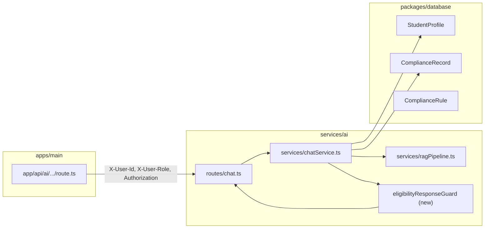

# Implementation plan: Student-facing eligibility AI (PRD v2.2)

> **Status:** Planned — not fully implemented as specified below. Existing pieces: `services/ai` (Hono chat + RAG), `apps/main` BFF at `app/api/ai/[...path]/route.ts`, Prisma models `User` / `StudentProfile` / `ComplianceRecord` / `ComplianceRule`.

## 1. Problem frame and scope boundary

### Problem

Students need **fast, grounded guidance** on eligibility-related questions without the product implying **final** NCAA or institutional clearance to compete. PRD v2.2 requires **decision support only**, citations, explicit disclaimers, and **no** definitive eligible/ineligible/cleared language unless an **authorized compliance** user has **recorded** a determination in AAH.

### In scope (MVP slice)

1. **Student role only** (`UserRole.STUDENT`): specialized system behavior for eligibility-themed chat (prompting + optional output safeguards), persistent **visible disclaimer**, and use of **rule pack + student record** context when available.
2. **Recorded determination gate**: allow mirrored **institutional** language only when a stored compliance artifact exists that counts as “recorded” for product purposes (see §3).
3. **Observability**: log eligibility-assistant turns with correlation IDs already propagated from the main app BFF.

### Out of scope (defer)

- Full conference overlays (e.g. Summit League) beyond existing roadmap.
- Automated blocking of **coach/admin** surfaces (separate policy); this plan focuses on **student-facing** PRD criteria.
- Replacing the compliance microservice rule engine; only **read** integration and **display** of flags/records for context.

### Requirements traceability

| PRD v2.2 acceptance criterion | Implementation hook |
|--------------------------------|---------------------|
| No final “you are eligible / ineligible / cleared to compete” without recorded determination | System prompt + **post-generation guard** for `STUDENT`; optional allow-list when DB says reviewed determination exists |
| Preliminary status, gaps, rule excerpts, uncertainty | RAG + injected **structured student snapshot** (missing fields explicit) |
| Visible copy: compliance authoritative | **UI footer** on chat widget + fixed suffix in assistant template for eligibility intents |
| Low-confidence / incomplete record blocks definitive language | Confidence from RAG validation + **missing-data checklist** in prompt; guard rejects forbidden phrases |

---

## 2. Architecture (high level)

**Decision:** Keep orchestration in **`services/ai`** so all clients (main app, future mobile) share one policy. The BFF already forwards `X-User-Role` and `X-Correlation-Id`; **chat must read role** (today `chat.ts` does not pass role into `chatService` — gap).

---

## 3. Key decisions

### 3.1 What counts as “recorded determination”

**Proposal for MVP:** Treat a row in `ComplianceRecord` as authoritative for **product mirroring** only when:

- `reviewedAt` is non-null **and** `reviewedBy` references a `User` whose `role === COMPLIANCE` (resolve `reviewedBy` as internal user id or Clerk mapping — **decide one identifier scheme** during implementation), **or**
- A future dedicated model `EligibilityDetermination` if compliance asks for separation from term GPA snapshots — **defer** unless stakeholders reject `ComplianceRecord`.

**Rationale:** Schema already has `ComplianceRecord.isEligible`, `reviewedBy`, `reviewedAt`, `ruleVersion` (`packages/database/prisma/schema.prisma`), aligning with “rule pack” language in the PRD.

### 3.2 Where forbidden phrases are enforced

| Layer | Purpose |
|-------|---------|
| System prompt | Primary behavioral constraint for STUDENT + eligibility intent |
| Post-process guard (`eligibilityResponseGuard`) | Deterministic block/redact of forbidden finals when role is STUDENT; strips or replaces with escalation copy |
| UI | Immutable disclaimer strip under messages for student eligibility threads |

**Decision:** Implement **both** prompt and guard; guard is the acceptance-test hook PRD requires.

### 3.3 Intent detection

**Decision:** Start with **lightweight keyword + classifier**: eligibility intents if message matches patterns / categories (“eligible”, “ineligible”, “clear”, “NCAA”, “progress toward degree”, etc.) OR optional small LLM classify step later. Avoid blocking non-eligibility chat with heavy-handed filters.

### 3.4 Temperature and RAG

For eligibility-classified student threads, lower **temperature** (e.g. 0.3–0.5) and **require** RAG hits or explicit “no sources retrieved” handling before speculation — align with `ragPipeline` validation flag (`services/ai/src/services/ragPipeline.ts`).

---

## 4. Implementation units and repo-relative paths

### Unit A — Wire auth context into chat

| Item | Path |
|------|------|
| Pass `userRole` from request headers into service options | `services/ai/src/routes/chat.ts` |
| Extend chat options with `{ userRole, correlationId }` | `services/ai/src/services/chatService.ts`, `services/ai/src/types/index.ts` |
| Ensure BFF forwards role (already sets headers) | `apps/main/app/api/ai/[...path]/route.ts` (verify only) |

### Unit B — Student eligibility prompt pack

| Item | Path |
|------|------|
| Add `systemPrompts.studentEligibilityPreliminary` (strict PRD v2.2 language) | `services/ai/src/config/index.ts` |
| Merge with RAG and **student snapshot** blocks | `services/ai/src/services/chatService.ts` |
| Load snapshot: `StudentProfile` + latest `ComplianceRecord` + active `ComplianceRule` summary | New helper e.g. `services/ai/src/services/studentEligibilityContext.ts` (uses `@aah/database`) |

### Unit C — Response guard

| Item | Path |
|------|------|
| Forbidden phrase list + “allow if reviewed determination” branch | `services/ai/src/services/eligibilityResponseGuard.ts` |
| Invoke guard in `onFinish` / sync path before persisting assistant message | `services/ai/src/services/chatService.ts` |
| Unit tests | `services/ai/src/services/__tests__/eligibilityResponseGuard.test.ts` |

### Unit D — Student UI disclaimer

| Item | Path |
|------|------|
| Chat widget / layout: show persistent disclaimer when user is student and topic is eligibility (or always on assistant tab — product choice) | Locate existing chat UI under `apps/main/` (search `Conversation`, `ai`, `chat`); add small presentational component |

*Discovery task:* grep `apps/main` for `/api/ai` or `aiService.chat` to attach exact file paths in first implementation PR.

### Unit E — Audit logging

| Item | Path |
|------|------|
| Append `AIAuditLog` or extend metadata on `Message` for eligibility-classified turns | `packages/database/prisma/schema.prisma` (if new fields needed), `services/ai/src/services/chatService.ts` |

Reuse patterns from `services/ai/src/routes/audit.ts` if present.

---

## 5. Dependencies and sequencing

1. **Unit A** must land first (role + correlation available in `chatService`).
2. **Unit B** and **Unit C** can proceed together after A; guard depends on snapshot shape from B.
3. **Unit D** after API behavior is stable (copy finalized).
4. **Unit E** last or parallel once message lifecycle is clear.

**External:** Stakeholder sign-off on definition of “recorded determination” (§3.1) before tuning allow-list behavior.

---

## 6. Test scenarios (must pass for MVP)

### `eligibilityResponseGuard`

1. **STUDENT** + text contains “You are eligible to compete” → output blocked or rewritten to preliminary language + escalation.
2. **STUDENT** + no reviewed compliance record → same as (1) for forbidden phrases.
3. **STUDENT** + reviewed `ComplianceRecord` exists for active term context → still **avoid** casual “cleared” wording unless explicitly mirroring stored status; prefer templated “Your file shows a compliance review recorded on …” (exact UX copy with legal).
4. **COACH** / **COMPLIANCE** → guard does **not** apply student forbidden-phrase rules (different policy document).

### `chatService` integration (integration or contract tests)

5. Mock Prisma: student with missing GPA → assistant message includes **data gaps** and no definitive eligibility verdict.
6. RAG returns zero sources → assistant states uncertainty and points to compliance staff.

### UI

7. Student eligibility thread renders **non-dismissible** one-line authority disclaimer (matches PRD “visible copy”).

---

## 7. Risks and mitigations

| Risk | Mitigation |
|------|------------|
| Model violates prompt despite guard | Guard + tests + monitoring on blocked-token counts |
| `ComplianceRecord` misused as athletic clearance | Product/legal clarify labels; possibly rename UI vs DB field meanings |
| Streaming emits forbidden phrase before guard runs | Run guard on **completed** assistant text in `onFinish` before persist; optionally stream replacement message |

---

## 8. Definition of done

- All test scenarios in §6 automated or manually signed off with recorded evidence.
- PRD v2.2 acceptance criteria demonstrable in staging (student demo account).
- Plan archived or updated when superseded; `docs/plans/README.md` lists this area as completed or rolled into another epic.
