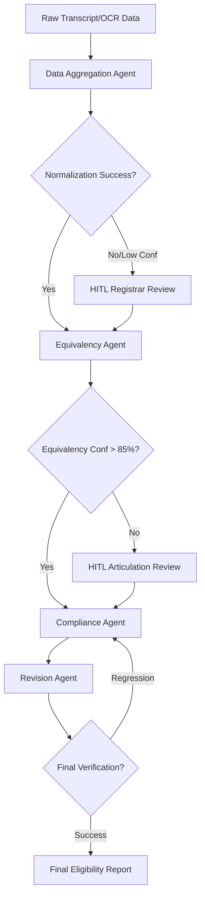

# Implementation Plan: NCAA Transfer Credit Agentic System

> Status: Planned / not yet implemented in this repository.
>
> This plan documents future work. The transfer-specific agents, tools, APIs, queueing flows, and reporting pages described here are not currently implemented in the repository.

This plan outlines the implementation of the multi-agent workflow for processing NCAA Division I transfer credits.

## 1. System Architecture
The system follows a sequential pipeline where each agent enhances the data with specialized logic before passing it to the next.

## 2. Component Breakdown

### Phase 1: Data Normalization
- **File**: `packages/ai/agents/data-aggregator-agent.ts` (To be created)
- **Responsibility**: Grade filtering (< C), Credit conversion (Quarter -> Semester), Accreditation check.

### Phase 2: Course Articulation
- **File**: `packages/ai/agents/equivalency-agent.ts` (To be created)
- **Responsibility**: Semantic mapping using RAG (Vector DB) of host university catalog.

### Phase 3: Compliance Validation
- **File**: `packages/ai/agents/compliance-agent.ts` (Update existing)
- **Responsibility**: Apply 6/18/24 rules and PTD percentages with Bylaw citations.

### Phase 4: Final Audit
- **File**: `packages/ai/agents/revision-agent.ts` (To be created)
- **Responsibility**: Regression testing against "Golden Source" and final summary generation.

## 3. Integration Plan
1. **Tooling**: Implement `transcript-tools.ts` for OCR extraction and `ncaa-tools.ts` for bylaw lookups.
2. **State Management**: Use `WorkflowState` to track student data as it passes through agents.
3. **HITL Hooks**: Implement a queue system for flags raised by the Equivalency Agent.

---

**Would you like me to write this implementation plan to a file (e.g., `IMPLEMENTATION_PLAN.md`)?**
