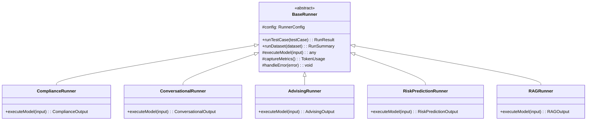

# AI Evaluation Framework Architecture

This document describes the architecture, design principles, and component interactions of the AI Evaluation Framework for the Athletic Academics Hub.

## Table of Contents

- [System Overview](#system-overview)
- [Design Principles](#design-principles)
- [Core Components](#core-components)
- [Component Interactions](#component-interactions)
- [Data Flow](#data-flow)
- [Integration Points](#integration-points)
- [Extension Points](#extension-points)
- [Performance Considerations](#performance-considerations)
- [Security Architecture](#security-architecture)

## System Overview

The AI Evaluation Framework is a comprehensive testing and quality assurance system designed to validate AI models and agents used throughout the Athletic Academics Hub platform. It provides automated evaluation, regression detection, and continuous quality monitoring for all AI-powered features.

### High-Level Architecture


### Key Design Goals

1. **Modularity**: Each component has clear responsibilities and can be used independently
2. **Extensibility**: Easy to add new runners, scorers, and evaluation strategies
3. **Performance**: Parallel execution with rate limiting and resource management
4. **Reliability**: Comprehensive error handling, retries, and graceful degradation
5. **Observability**: Detailed logging, metrics, and progress tracking
6. **Type Safety**: Full TypeScript type coverage for compile-time safety

## Design Principles

### 1. Separation of Concerns

Each component handles a specific aspect of evaluation:
- **Dataset Manager**: Dataset storage and validation
- **Runners**: Model execution and result capture
- **Scorers**: Output evaluation and scoring
- **Orchestrator**: Job coordination and workflow management

### 2. Single Responsibility

Components have well-defined, focused responsibilities:
- A runner executes models but doesn't score results
- A scorer evaluates outputs but doesn't execute models
- The orchestrator coordinates but doesn't execute or score

### 3. Open/Closed Principle

The framework is:
- **Open for extension**: New runners, scorers, and strategies can be added
- **Closed for modification**: Core logic remains stable

Example: Adding a new AI model requires creating a new runner, not modifying existing code.

### 4. Dependency Inversion

High-level modules depend on abstractions, not concrete implementations:

```typescript
// Bad: Direct dependency
class EvalOrchestrator {
  private runner = new GPT4Runner(); // Tight coupling
}

// Good: Dependency injection
class EvalOrchestrator {
  constructor(private runner: Runner) {} // Flexible
}
```

### 5. Fail-Fast with Graceful Degradation

- Validate inputs early (fail-fast)
- Handle runtime errors gracefully
- Continue processing when individual tests fail
- Provide detailed error context

## Core Components

### 1. Dataset Manager

**Purpose**: Manage test datasets with versioning, validation, and CRUD operations.

**Key Features**:
- Schema validation using Zod
- Version control for datasets
- Metadata tracking (author, created date, tags)
- Lazy loading for large datasets
- Export in multiple formats (JSON, CSV, YAML)

**Architecture**:


**Storage Format**:

Datasets are stored as JSON files with the following structure:

```json
{
  "id": "compliance-eligibility-v1",
  "name": "NCAA Compliance Eligibility Tests",
  "version": "1.0.0",
  "testCases": [
    {
      "id": "test-001",
      "input": { /* ... */ },
      "expected": { /* ... */ },
      "metadata": {
        "difficulty": "medium",
        "category": "initial-eligibility",
        "tags": ["gpa", "core-courses"]
      }
    }
  ],
  "metadata": {
    "createdAt": "2025-01-08T00:00:00Z",
    "updatedAt": "2025-01-08T00:00:00Z"
  }
}
```

### 2. Runner Engine

**Purpose**: Execute AI models/agents against test cases and capture results.

**Architecture**:



**Runner Responsibilities**:

1. **Model Execution**: Call AI models with proper formatting and context
2. **Error Handling**: Retry logic, timeout management, graceful failure
3. **Metrics Capture**: Token usage, latency, cost calculation
4. **Context Management**: Conversation history, session state
5. **Result Formatting**: Standardize outputs for scoring

**Key Features**:
- Configurable timeouts and retries
- Automatic token usage tracking
- Cost calculation per test case
- Support for streaming responses
- Rate limiting integration

### 3. Scorer Engine

**Purpose**: Evaluate model outputs against expected results using various strategies.

**Scoring Strategies**:


**Scorer Types**:

| Scorer | Use Case | Accuracy | Speed | Cost |
|--------|----------|----------|-------|------|
| **Exact Match** | Structured outputs (JSON, enums) | Deterministic | Very Fast | Free |
| **Semantic Similarity** | Text responses, paraphrasing | ~85% | Fast | Low |
| **LLM Judge** | Quality, tone, helpfulness | ~90% | Slow | Medium |
| **Precision/Recall** | Multi-label outputs | Deterministic | Fast | Free |
| **Recall@K** | RAG retrieval quality | Deterministic | Fast | Free |

**Architecture**:


### 4. Eval Orchestrator

**Purpose**: Coordinate all evaluation operations including job management, parallel execution, baseline comparison, and reporting.

**Components**:


#### Job Manager

Manages evaluation job lifecycle:

- **Job Creation**: Queue and configure evaluation jobs
- **Status Tracking**: Monitor job progress and state
- **Cancellation**: Support graceful job termination
- **Queue Management**: Handle multiple concurrent jobs

#### Parallel Executor

Executes test cases in parallel:

- **Task Distribution**: Distribute work across workers
- **Rate Limiting**: Respect API rate limits
- **Progress Tracking**: Real-time progress updates
- **Error Recovery**: Retry failed tasks, isolate errors

**Execution Model**:


#### Baseline Comparator

Compares current results to baselines:

- **Regression Detection**: Identify performance drops
- **Severity Classification**: Critical/Major/Minor
- **Improvement Tracking**: Identify performance gains
- **Threshold Configuration**: Customizable regression limits

**Comparison Process**:


#### Report Generator

Generates comprehensive evaluation reports:

- **Metrics Aggregation**: Calculate summary statistics
- **Category Breakdown**: Performance by test category
- **Difficulty Analysis**: Pass rates by difficulty level
- **Export Options**: JSON, CSV, HTML formats
- **Recommendations**: Actionable insights

## Component Interactions

### Evaluation Workflow


### Dataset Creation Workflow


### Parallel Execution Flow


## Data Flow

### Test Case Data Flow

```mermaid
flowchart LR
    subgraph Input
        TC[Test Case]
        Input[Input Data]
        Expected[Expected Output]
    end

    subgraph Execution
        Runner[Runner]
        Model[AI Model]
        Actual[Actual Output]
    end

    subgraph Evaluation
        Scorer[Scorer]
        Score[Score]
        Passed[Pass/Fail]
    end

    subgraph Storage
        RunResult[Run Result]
        DB[(Database)]
    end

    TC --> Runner
    Input --> Runner
    Runner --> Model
    Model --> Actual

    Expected --> Scorer
    Actual --> Scorer
    Scorer --> Score
    Score --> Passed

    TC --> RunResult
    Actual --> RunResult
    Score --> RunResult
    RunResult --> DB

    style Model fill:#f5a623
    style Score fill:#7ed321
    style DB fill:#4a90e2
```

### Report Generation Data Flow


## Integration Points

### Integration with AAH Services

The evaluation framework integrates with AAH microservices to test end-to-end functionality:


### CI/CD Integration


### External API Integration

```typescript
// OpenAI Integration
const openaiClient = new OpenAI({
  apiKey: process.env.OPENAI_API_KEY,
  timeout: 30000,
  maxRetries: 3,
});

// Anthropic Integration
const anthropicClient = new Anthropic({
  apiKey: process.env.ANTHROPIC_API_KEY,
});

// Rate limiting wrapper
const rateLimitedCall = rateLimit(apiCall, {
  requestsPerMinute: 100,
  tokensPerMinute: 100000,
});
```

## Extension Points

### Adding a New Runner

```typescript
import { BaseRunner } from './base-runner';
import { RunResult, RunnerConfig } from '../types';

export class MyCustomRunner extends BaseRunner {
  constructor(config: RunnerConfig) {
    super(config);
  }

  protected async executeModel(input: MyInput): Promise<MyOutput> {
    // 1. Format input for your model
    const formattedInput = this.formatInput(input);

    // 2. Call your model/service
    const response = await myService.execute(formattedInput);

    // 3. Parse and return output
    return this.parseOutput(response);
  }

  private formatInput(input: MyInput): string {
    // Custom formatting logic
    return JSON.stringify(input);
  }

  private parseOutput(response: any): MyOutput {
    // Custom parsing logic
    return response.data;
  }
}
```

### Adding a New Scorer

```typescript
import { Scorer, Score } from '../types';

export class MyCustomScorer implements Scorer {
  async score(expected: any, actual: any, config: ScorerConfig): Promise<Score> {
    // 1. Implement your scoring logic
    const score = this.calculateScore(expected, actual);

    // 2. Determine pass/fail
    const passed = score >= (config.threshold || 0.7);

    // 3. Generate explanation
    const explanation = this.generateExplanation(expected, actual, score);

    return {
      passed,
      score,
      confidence: 0.95,
      explanation,
    };
  }

  private calculateScore(expected: any, actual: any): number {
    // Custom scoring algorithm
    // Return value between 0 and 1
    return 0.85;
  }

  private generateExplanation(expected: any, actual: any, score: number): string {
    return `Score: ${score}. Custom explanation here.`;
  }
}
```

### Adding a New Dataset Type

```typescript
import { DatasetSchema } from '../types';
import { z } from 'zod';

// 1. Define input/output schemas
const MyInputSchema = z.object({
  field1: z.string(),
  field2: z.number(),
});

const MyOutputSchema = z.object({
  result: z.string(),
  confidence: z.number(),
});

// 2. Create dataset schema
const myDatasetSchema: DatasetSchema = {
  input: MyInputSchema,
  output: MyOutputSchema,
};

// 3. Create dataset with schema
const dataset = await datasetManager.createDataset({
  name: 'my-custom-dataset',
  description: 'Dataset for my custom feature',
  schema: myDatasetSchema,
});
```

## Performance Considerations

### Parallel Execution

The framework uses a worker pool for parallel execution:

```typescript
const parallelExecutor = new ParallelExecutor({
  maxWorkers: os.cpus().length, // Use all CPU cores
  concurrency: 10, // Max 10 concurrent API calls
  rateLimit: {
    requestsPerMinute: 100,
    tokensPerMinute: 100000,
  },
});
```

**Optimization Strategies**:

1. **Batch Processing**: Group similar test cases for efficiency
2. **Connection Pooling**: Reuse HTTP connections
3. **Result Streaming**: Stream results as they complete
4. **Early Termination**: Stop on critical failures (optional)
5. **Caching**: Cache embeddings and repeated calls

### Memory Management

For large datasets:

```typescript
// Lazy loading
const dataset = await datasetManager.loadDataset('large-dataset', {
  lazy: true, // Don't load all test cases into memory
});

// Process in chunks
const chunkSize = 100;
for (let i = 0; i < dataset.testCases.length; i += chunkSize) {
  const chunk = dataset.testCases.slice(i, i + chunkSize);
  await processChunk(chunk);
}
```

### Cost Optimization

```typescript
// Use cheaper models for initial screening
const quickScorer = new SemanticSimilarityScorer({
  model: 'text-embedding-3-small', // Cheaper
});

// Use expensive LLM judge only for failures
if (!quickScore.passed) {
  const detailedScore = await llmJudgeScorer.score(expected, actual);
}
```

## Security Architecture

### API Key Management

```typescript
// Never hardcode API keys
const apiKey = process.env.OPENAI_API_KEY;

// Validate keys at startup
if (!apiKey) {
  throw new Error('OPENAI_API_KEY environment variable required');
}

// Use key rotation
const keyManager = new APIKeyManager({
  keys: [process.env.PRIMARY_KEY, process.env.BACKUP_KEY],
  rotationStrategy: 'round-robin',
});
```

### PII Protection

```typescript
// Scan inputs for PII before execution
const piiDetector = new PIIDetector();
const detections = piiDetector.scan(testCase.input);

if (detections.length > 0) {
  throw new Error('PII detected in test input - FERPA violation');
}

// Anonymize production data
const anonymizer = new DataAnonymizer({
  preserveFormat: true,
  consistentMapping: true,
});
const anonymizedData = anonymizer.anonymize(productionData);
```

### Audit Logging

```typescript
// Log all dataset access
const auditLogger = new DatasetAuditLogger();
await auditLogger.log({
  action: 'READ',
  datasetName: dataset.name,
  userId: currentUser.id,
  ipAddress: req.ip,
  success: true,
});
```

## Diagrams

### Component Dependency Graph


### Technology Stack


---

**Document Version**: 1.0.0
**Last Updated**: 2025-01-08
**Next Review**: 2025-02-08
