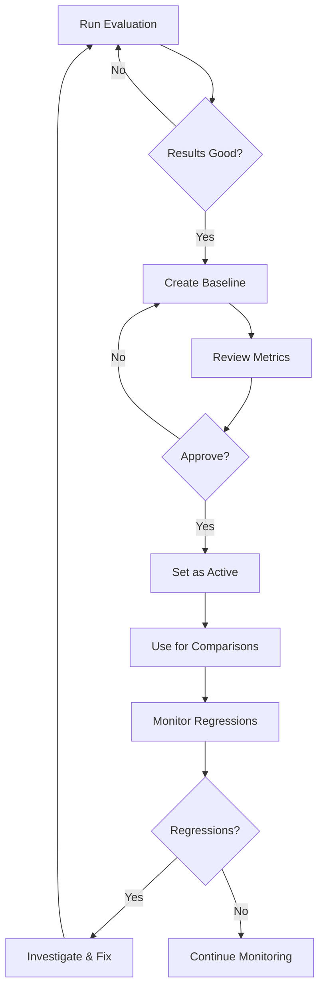

# Baseline Management Guide

Complete guide to managing evaluation baselines for regression detection.

## Table of Contents

- [What Are Baselines?](#what-are-baselines)
- [Creating Baselines](#creating-baselines)
- [Baseline Workflow](#baseline-workflow)
- [Regression Thresholds](#regression-thresholds)
- [Lifecycle Management](#lifecycle-management)
- [Best Practices](#best-practices)
- [Advanced Topics](#advanced-topics)

## What Are Baselines?

### Definition

A **baseline** is a snapshot of metrics from a successful evaluation run that serves as a reference point for detecting regressions in future runs.

### Purpose

- **Regression Detection**: Identify when performance drops
- **Quality Gates**: Block deployments when quality degrades
- **Trend Tracking**: Monitor improvement or degradation over time
- **Release Validation**: Ensure new releases maintain quality

### Components

A baseline contains:
- **Metrics**: Accuracy, latency, cost statistics
- **Test Results**: Individual test case results
- **Metadata**: When created, by whom, why
- **Status**: Active or archived

## Creating Baselines

### When to Create Baselines

✅ **Good Times**:
- After successful production deployment
- After major feature completion
- When establishing quality standards
- After significant performance improvements

❌ **Bad Times**:
- During active development
- When tests are failing
- After known regressions
- On unstable branches

### Step-by-Step Guide

#### 1. Run Evaluation

```bash
# Run evaluation with all tests
ai-evals run --dataset compliance-eligibility \
             --dataset conversational-ncaa \
             --model gpt-4-turbo
```

#### 2. Verify Results

```bash
# Check report
ai-evals report --latest

# Ensure:
# - Accuracy >95%
# - No critical failures
# - Results are stable
```

#### 3. Create Baseline

```bash
# Via CLI
ai-evals baseline create \
  --name "Production v1.0" \
  --description "Initial production baseline" \
  --from-run <run-id>

# Via API
const baselineId = orchestrator.storeBaseline(
  'Production v1.0',
  'Baseline after v1.0 launch',
  report.jobId,
  report.metrics
);
```

#### 4. Set as Active

```bash
# Via CLI
ai-evals baseline set-active <baseline-id>

# Via API
orchestrator.setActiveBaseline(baselineId);
```

### Baseline Naming Convention

Use descriptive, versioned names:

```
Format: <Environment> <Version/Purpose> [Date]

Examples:
✅ "Production v1.0 - Jan 2025"
✅ "Staging Post-Migration"
✅ "Development Sprint-42"

❌ "Baseline 1"
❌ "Current"
❌ "Test"
```

## Baseline Workflow

### Standard Workflow



### Development Workflow

```
Developer Branch:
1. Create feature branch
2. Make changes to AI code
3. Run evaluations vs dev baseline
4. Compare results
5. If regressions: Fix before PR
6. Create PR with eval results

PR Review:
7. CI runs evaluations vs staging baseline
8. Reviewer checks for regressions
9. Approve if no critical regressions
10. Merge to main

Production:
11. Deploy to staging
12. Run evaluations vs production baseline
13. Review results
14. Deploy to production
15. Create new production baseline
```

## Regression Thresholds

### Default Thresholds

```typescript
const thresholds = {
  critical: {
    accuracyDrop: 0.15,    // 15% drop
    latencyIncrease: 2.0,  // 2x increase
    costIncrease: 2.0,     // 2x increase
  },
  major: {
    accuracyDrop: 0.10,    // 10% drop
    latencyIncrease: 1.5,  // 50% increase
    costIncrease: 1.5,     // 50% increase
  },
  minor: {
    accuracyDrop: 0.05,    // 5% drop
    latencyIncrease: 1.2,  // 20% increase
    costIncrease: 1.2,     // 20% increase
  },
};
```

### Customizing Thresholds

#### Per Environment

```yaml
# production.yaml
baselineComparison:
  thresholds:
    critical:
      accuracyDrop: 0.10   # Stricter in prod
    major:
      accuracyDrop: 0.05

# development.yaml
baselineComparison:
  thresholds:
    critical:
      accuracyDrop: 0.20   # More lenient in dev
    major:
      accuracyDrop: 0.15
```

#### Per Metric

```typescript
const customThresholds = {
  accuracy: {
    critical: 0.10,  // 10% drop is critical
    major: 0.05,
    minor: 0.02,
  },
  latency: {
    critical: 3.0,   // 3x increase is critical
    major: 2.0,
    minor: 1.5,
  },
  cost: {
    critical: 2.5,   // 2.5x increase is critical
    major: 1.8,
    minor: 1.3,
  },
};
```

### Interpreting Regressions

**Critical Regression**
```
Action: BLOCK DEPLOYMENT
Notification: Immediate Slack/email alert
Review: Required before any deployment
Timeline: Fix within 24 hours
```

**Major Regression**
```
Action: REQUIRE REVIEW
Notification: Slack notification
Review: Team lead approval needed
Timeline: Fix in current sprint
```

**Minor Regression**
```
Action: MONITOR
Notification: Add to backlog
Review: Optional
Timeline: Fix in next sprint
```

## Lifecycle Management

### Baseline States

```typescript
enum BaselineState {
  ACTIVE = 'active',      // Currently used for comparisons
  ARCHIVED = 'archived',  // Historical reference
  DEPRECATED = 'deprecated', // No longer valid
}
```

### Managing Multiple Baselines

#### Environment-Specific

```
production-baseline    (active)
staging-baseline      (active)
development-baseline  (active)
```

#### Version-Specific

```
prod-v1.0-baseline    (archived)
prod-v1.1-baseline    (archived)
prod-v1.2-baseline    (active)
```

### Updating Baselines

**When to Update**:
- After successful production deployment
- After intentional performance changes
- Quarterly maintenance updates
- After major feature releases

**Update Process**:

```bash
# 1. Run evaluation
ai-evals run

# 2. Compare to current baseline
ai-evals compare --baseline current

# 3. If improvements or no regressions:
ai-evals baseline create \
  --name "Production v1.2" \
  --from-run <run-id>

# 4. Archive old baseline
ai-evals baseline archive <old-baseline-id>

# 5. Activate new baseline
ai-evals baseline set-active <new-baseline-id>
```

### Archiving Strategy

**Keep**:
- Baselines from major releases
- Quarterly snapshots
- Pre/post major changes

**Archive**:
- Old development baselines
- Superseded versions
- Failed baseline attempts

**Retention**:
```
Active: 1-3 baselines
Recent: Last 6 months
Historical: Major releases only
```

## Best Practices

### 1. Single Source of Truth

```bash
# ✅ Good: One active baseline per environment
production: prod-v1.2-baseline (active)
staging: staging-latest (active)

# ❌ Bad: Multiple active baselines
production: baseline1 (active)
production: baseline2 (active)  # Confusion!
```

### 2. Document Context

```typescript
const baseline = orchestrator.storeBaseline(
  'Production v1.2 - Post GPT-4 Migration',
  `Created after migrating from GPT-3.5 to GPT-4.
   Expected improvements in accuracy.
   Previous baseline: prod-v1.1-baseline
   Migration ticket: JIRA-123`,
  report.jobId,
  report.metrics
);
```

### 3. Regular Reviews

```
Weekly: Check for regressions in dev
Monthly: Review baseline validity
Quarterly: Update production baselines
Annually: Archive old baselines
```

### 4. Version Control Baselines

```bash
# Store baseline IDs in version control
# baselines.json
{
  "production": {
    "current": "baseline-abc123",
    "previous": "baseline-def456",
    "createdAt": "2025-01-08",
    "metrics": {
      "accuracy": 0.95,
      "avgLatency": 1200
    }
  }
}
```

### 5. Automate Baseline Updates

```typescript
// scripts/auto-baseline.ts
async function autoUpdateBaseline() {
  // Run evaluation
  const report = await runEvaluation();

  // Compare to baseline
  const comparison = compareToBaseline(report);

  // If improvements and no regressions
  if (comparison.improvements.length > 0 &&
      comparison.regressions.length === 0) {

    // Archive old
    await archiveBaseline(currentBaseline.id);

    // Create new
    const newBaseline = await createBaseline(report);

    // Activate
    await setActiveBaseline(newBaseline.id);

    // Notify team
    await notifyTeam(`Baseline auto-updated to ${newBaseline.id}`);
  }
}
```

## Advanced Topics

### Baseline Comparison API

```typescript
const comparison = orchestrator.compareToBaseline(
  currentMetrics,
  currentRunId,
  baselineId
);

console.log('Comparison Summary:');
console.log(`Total Regressions: ${comparison.summary.totalRegressions}`);
console.log(`Critical: ${comparison.summary.criticalRegressions}`);
console.log(`Major: ${comparison.summary.majorRegressions}`);
console.log(`Minor: ${comparison.summary.minorRegressions}`);

// Detailed regressions
comparison.regressions.forEach(regression => {
  console.log(`${regression.testCaseId}:`);
  console.log(`  Metric: ${regression.metric}`);
  console.log(`  Baseline: ${regression.baseline}`);
  console.log(`  Current: ${regression.current}`);
  console.log(`  Change: ${regression.percentChange}%`);
  console.log(`  Severity: ${regression.severity}`);
});
```

### Multi-Baseline Comparison

```typescript
// Compare against multiple baselines
const baselines = ['prod-v1.0', 'prod-v1.1', 'prod-v1.2'];

for (const baselineId of baselines) {
  const comparison = orchestrator.compareToBaseline(
    currentMetrics,
    currentRunId,
    baselineId
  );

  console.log(`\nVs ${baselineId}:`);
  console.log(`Accuracy: ${comparison.metrics.accuracyDelta}%`);
  console.log(`Latency: ${comparison.metrics.latencyDelta}%`);
  console.log(`Cost: ${comparison.metrics.costDelta}%`);
}
```

### Baseline Migration

```typescript
// Migrate baseline to new schema
async function migrateBaseline(oldBaselineId: string) {
  const oldBaseline = await loadBaseline(oldBaselineId);

  // Transform to new format
  const newMetrics = {
    ...oldBaseline.metrics,
    // Add new fields
    byModel: calculateByModel(oldBaseline),
    byCategory: calculateByCategory(oldBaseline),
  };

  // Create new baseline
  const newBaselineId = await createBaseline({
    name: `${oldBaseline.name} (Migrated)`,
    description: `Migrated from ${oldBaselineId}`,
    metrics: newMetrics,
  });

  // Mark old as deprecated
  await deprecateBaseline(oldBaselineId);

  return newBaselineId;
}
```

### Conditional Baseline Updates

```typescript
async function conditionalBaselineUpdate(report: EvalReport) {
  const comparison = compareToBaseline(report);

  // Update if significant improvement
  const significantImprovement =
    comparison.summary.totalImprovements > 5 &&
    comparison.summary.totalRegressions === 0 &&
    report.summary.accuracy > 0.95;

  // Update if minor changes within threshold
  const minorChanges =
    comparison.summary.totalRegressions === 0 &&
    Math.abs(comparison.metrics.accuracyDelta) < 0.02;

  if (significantImprovement || minorChanges) {
    await updateBaseline(report);
    return true;
  }

  return false;
}
```

---

**Last Updated**: 2025-01-08
**Framework Version**: 1.0.0
