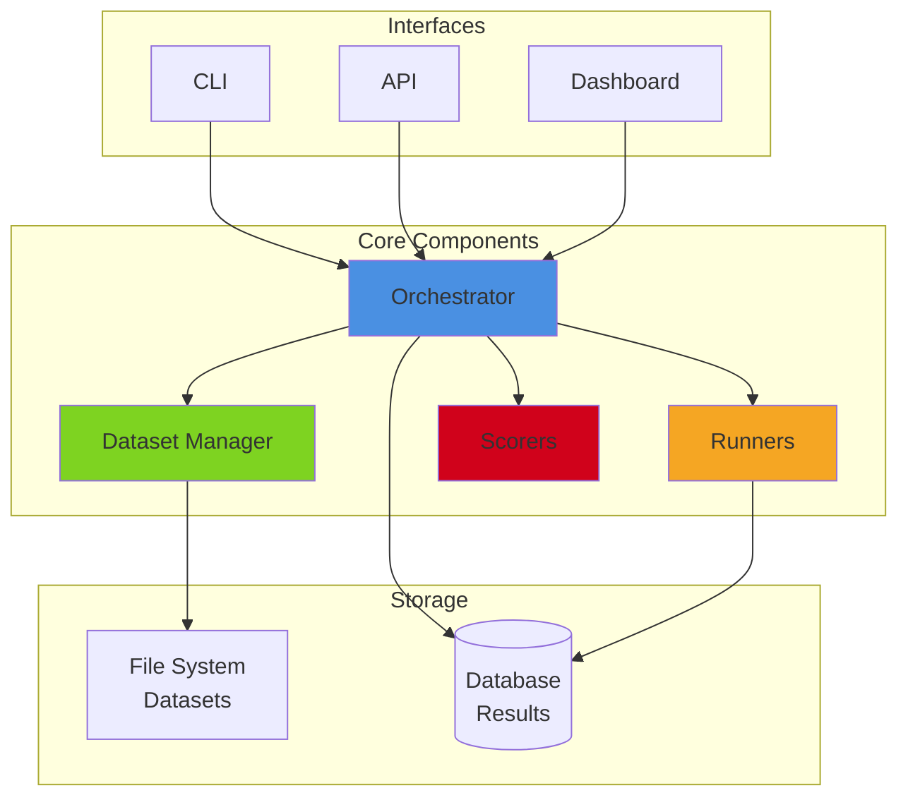

# AI Evaluation Framework Documentation

Welcome to the comprehensive documentation for the Athletic Academics Hub AI Evaluation Framework. This documentation covers everything you need to know to effectively use, extend, and maintain the evaluation system.

## 📚 Documentation Index

### Developer Documentation (Task 13.1)

**Architecture & Design**
- [**ARCHITECTURE.md**](./ARCHITECTURE.md) - System architecture, component interactions, and design patterns
  - Overall system design and philosophy
  - Component relationships and data flow
  - Integration with AAH microservices
  - Extension points and customization

**API Reference**
- [**API_REFERENCE.md**](./API_REFERENCE.md) - Complete API documentation for all public interfaces
  - Core APIs (Dataset Manager, Runners, Scorers, Orchestrator)
  - Type definitions and interfaces
  - Method signatures and usage examples
  - Configuration options

**Code Examples**
- [**EXAMPLES.md**](./EXAMPLES.md) - Practical examples for common use cases
  - Quick start examples
  - Feature-specific runner examples
  - Custom scorer implementation
  - Advanced orchestration patterns

**Troubleshooting**
- [**TROUBLESHOOTING.md**](./TROUBLESHOOTING.md) - Common issues and solutions
  - Setup and configuration issues
  - Execution and runtime errors
  - Performance optimization
  - Debugging strategies

### User Guides (Task 13.2)

**Dataset Creation**
- [**DATASET_CREATION_GUIDE.md**](./DATASET_CREATION_GUIDE.md) - Creating and managing test datasets
  - Dataset structure and schema design
  - Writing effective test cases
  - Dataset versioning and organization
  - Quality assurance best practices

**Running Evaluations**
- [**USER_GUIDE.md**](./USER_GUIDE.md) - Running evals via CLI and dashboard
  - CLI command reference
  - Dashboard walkthrough
  - Configuration file setup
  - Scheduling and automation

**Report Interpretation**
- [**REPORT_INTERPRETATION.md**](./REPORT_INTERPRETATION.md) - Understanding evaluation reports
  - Metrics explained
  - Identifying regressions and improvements
  - Performance analysis
  - Making data-driven decisions

**Baseline Management**
- [**BASELINE_MANAGEMENT.md**](./BASELINE_MANAGEMENT.md) - Managing evaluation baselines
  - Creating and updating baselines
  - Baseline comparison workflow
  - Regression thresholds
  - Baseline lifecycle management

### Demo Scripts (Task 13.3)

**Video Walkthroughs**
- [**DEMO_SCRIPTS.md**](./DEMO_SCRIPTS.md) - Scripts and guides for demo videos
  - System setup walkthrough
  - Running evaluations and analyzing results
  - Adding test cases and datasets
  - Advanced features demonstration

## 🚀 Getting Started

If you're new to the AI Evaluation Framework, we recommend following this learning path:

### For Developers
1. Start with [ARCHITECTURE.md](./ARCHITECTURE.md) to understand the system design
2. Review [API_REFERENCE.md](./API_REFERENCE.md) for technical details
3. Work through [EXAMPLES.md](./EXAMPLES.md) to see practical implementations
4. Keep [TROUBLESHOOTING.md](./TROUBLESHOOTING.md) handy for debugging

### For QA/Testing Teams
1. Begin with [USER_GUIDE.md](./USER_GUIDE.md) to learn the basics
2. Follow [DATASET_CREATION_GUIDE.md](./DATASET_CREATION_GUIDE.md) to create test datasets
3. Use [REPORT_INTERPRETATION.md](./REPORT_INTERPRETATION.md) to understand results
4. Reference [BASELINE_MANAGEMENT.md](./BASELINE_MANAGEMENT.md) for regression testing

### For Product/Management
1. Watch the demos outlined in [DEMO_SCRIPTS.md](./DEMO_SCRIPTS.md)
2. Review [REPORT_INTERPRETATION.md](./REPORT_INTERPRETATION.md) for metrics insights
3. Understand [BASELINE_MANAGEMENT.md](./BASELINE_MANAGEMENT.md) for quality gates

## 📖 Quick Reference

### Most Common Tasks

| Task | Documentation |
|------|---------------|
| Install and set up the framework | [USER_GUIDE.md § Installation](./USER_GUIDE.md#installation) |
| Create a new test dataset | [DATASET_CREATION_GUIDE.md § Creating Datasets](./DATASET_CREATION_GUIDE.md#creating-datasets) |
| Run evaluations via CLI | [USER_GUIDE.md § CLI Usage](./USER_GUIDE.md#cli-usage) |
| Interpret evaluation results | [REPORT_INTERPRETATION.md](./REPORT_INTERPRETATION.md) |
| Set up baseline for regression testing | [BASELINE_MANAGEMENT.md § Creating Baselines](./BASELINE_MANAGEMENT.md#creating-baselines) |
| Implement custom scorer | [EXAMPLES.md § Custom Scorers](./EXAMPLES.md#custom-scorers) |
| Debug test failures | [TROUBLESHOOTING.md § Test Failures](./TROUBLESHOOTING.md#test-failures) |
| Integrate with CI/CD | [USER_GUIDE.md § CI/CD Integration](./USER_GUIDE.md#cicd-integration) |

### Key Concepts

- **Test Case**: A single unit of evaluation containing input, expected output, and metadata
- **Dataset**: A collection of related test cases with versioning and validation
- **Runner**: Executes AI models against test cases and captures results
- **Scorer**: Evaluates model outputs against expected results using various strategies
- **Orchestrator**: Coordinates job management, parallel execution, and reporting
- **Baseline**: A reference point for detecting regressions in model performance
- **Job**: A complete evaluation run encompassing datasets, models, and scorers

## 🏗️ Framework Overview



## 🔧 System Requirements

- **Node.js**: 18.x or higher
- **TypeScript**: 5.x or higher
- **Database**: PostgreSQL (via Vercel Postgres)
- **APIs**: OpenAI and/or Anthropic API keys

## 📞 Support & Contributing

### Getting Help
- Check [TROUBLESHOOTING.md](./TROUBLESHOOTING.md) for common issues
- Search existing [GitHub Issues](https://github.com/your-org/athletic-academics-hub/issues)
- Join the team Slack channel: `#ai-evals`

### Reporting Issues
When reporting issues, please include:
- Framework version (`ai-evals --version`)
- Operating system and Node.js version
- Full error message and stack trace
- Minimal reproducible example
- Configuration file (redact sensitive data)

### Contributing
- Review [ARCHITECTURE.md](./ARCHITECTURE.md) to understand the design
- Follow the coding standards in existing code
- Add tests for new features
- Update documentation for API changes
- Submit pull requests with clear descriptions

## 📄 License

This documentation is part of the Athletic Academics Hub project and follows the same license terms.

## 🗺️ Documentation Map

```
docs/
├── README.md                         # This file - Documentation index
├── ARCHITECTURE.md                   # System architecture and design
├── API_REFERENCE.md                  # Complete API documentation
├── EXAMPLES.md                       # Code examples and patterns
├── TROUBLESHOOTING.md                # Common issues and solutions
├── DATASET_CREATION_GUIDE.md         # Dataset creation guide
├── USER_GUIDE.md                     # CLI and dashboard user guide
├── REPORT_INTERPRETATION.md          # Understanding reports
├── BASELINE_MANAGEMENT.md            # Baseline workflow guide
└── DEMO_SCRIPTS.md                   # Video demonstration scripts
```

---

**Last Updated**: 2025-01-08
**Framework Version**: 1.0.0
**Maintainer**: Athletic Academics Hub Team
